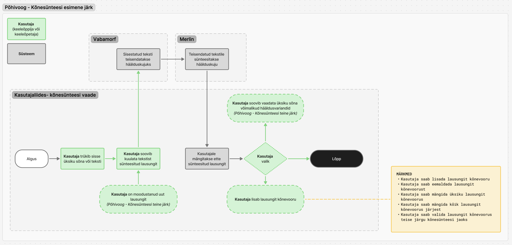
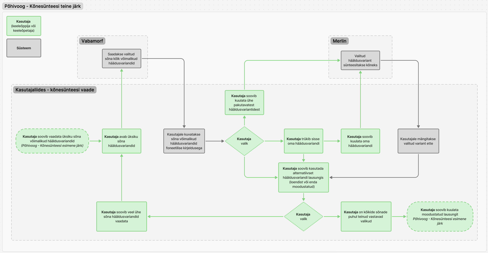
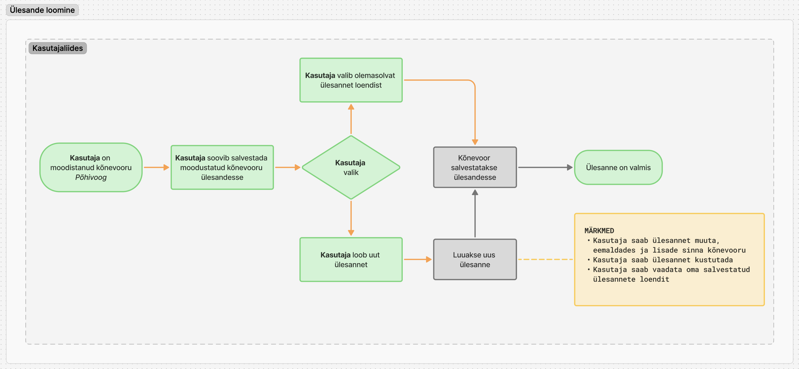
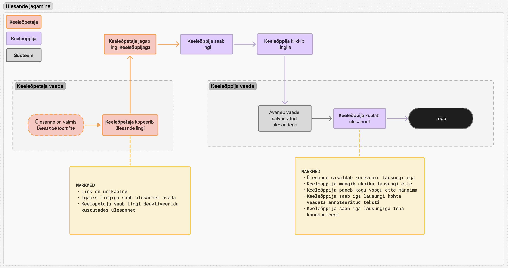
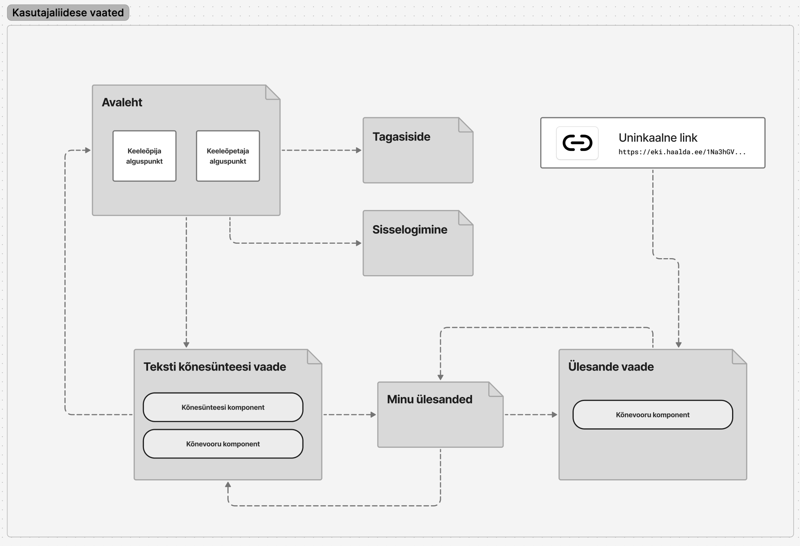

# Hääldusabilise kasutajaliides

## Analüüsidokument

## Hääldusabilise kasutajaliides

### Analüüsidokument

Hääldusabilise kasutajaliides .................................................................................. 1

Sissejuhatus........................................................................................................... 4

Eesmärk ja suund.................................................................................................... 4

Tarkvara peamised kasutusvaldkonnad ja sihtrühmad............................................ 4

Kasutuselevõtt ja levitamine ................................................................................. 5

Jätkusuutlikkus ja edasiarendus............................................................................ 5

Peamised põhimõtted tulevaseks arenduseks ....................................................... 6

Rollid ja nende vajadused ........................................................................................ 6

Keeleõppija põhivajadused................................................................................... 6

Keeleõppija peamised kasutusstsenaariumid ..................................................... 7

Keeleõpetaja põhivajadused................................................................................. 7

Keeleõpetaja kasutusstsenaariumid .................................................................. 8

Rollipõhine ligipääsetavus funktsionaalsusele .......................................................... 8

Tehnilised ja UX-eesmärgid................................................................................... 9

Põhiliste kasutajavoogude diagrammid................................................................... 10

Põhivoog – Kõnesünteesi esimene järk ................................................................ 10

Põhivoog – Kõnesünteesi teine järk...................................................................... 11

Ülesande loomine.............................................................................................. 12

Ülesande jagamine ............................................................................................ 13

Kasutajaliidese (UI) vaated..................................................................................... 13

Funktsionaalsuse loetelu....................................................................................... 15

1. Sisselogimine ............................................................................................. 15

2. Kõnesünteesi esimene järk.......................................................................... 15

    a. Trükki sisse sõna või tekst ........................................................................ 15

    b. Saa sünteesitud teksti hääldus- ja heli teisendust (Vabamorf + Merlinist)..... 15

    c. Kuula lausungi hääldust........................................................................... 16

    d. Vaata sünteesitud teksti häälduskujulist teisendust................................... 16

3. Kõnesünteesi teine järk ............................................................................... 16

    a. Vali üksik sõna lausungist ........................................................................ 16

    b. Saa selle sünteesitud variandid hääldus- ja heli teisendust (Vabamorf + Merlin) ning kuva kasutajale............................................................................. 16

    c. Kuula sõna alternatiivsed hääldusvariandid või vaata nende häälduskuju variandid........................................................................................................ 17

    d. Vali üks pakutavast variandist ja asenda see lausungis............................... 17

    e. Saa uue lausungi sünteesitud heli (Vabamorf + Merlin)............................... 17

    f. Kuula lausungi uue variandiga .................................................................. 17

    g. Lausungi eksportimine heli- ja tekstifaili (wav) ........................................... 17

4. II järgu kõnesünteesi täiendavad funktsioonid............................................... 17

    a. Hääldusvariandi moodustamine - Lisa või eemalda hääldusmärke valitud sõnal.............................................................................................................. 17

    b. Saa uue lausungi heli (Vabamorf + Merlin) ................................................. 18

    c. Kuula saadud hääldusvariant (Vabamorf + Merlin) ..................................... 18

5. Kõnevooru moodustamine .......................................................................... 18

6. Ülesannete haldamine ................................................................................ 18

7. Salvestatud ülesannete vaatamine ja ligipääs unikaalse lingi kaudu ............... 19

8. Tagasiside andmine .................................................................................... 19

Ligipääsu loogika ja funktsionaalsuse eristused ...................................................... 20

Kasutaja seisund ja funktsionaalsus.................................................................... 20

Kasutaja roll ja funktsionaalsus........................................................................... 20

Foneetilised kategooriad ja nende kasutus.............................................................. 20

## Sissejuhatus

Käesolev dokument kirjeldab Hääldusabilise kasutajaliidese (ka E-vahend, või tarkvara) funktsionaalsuse nõuete analüüsi. Analüüsi eesmärk on luua ühtne arusaam sellest, milliseid vajadusi tarkvara peab täitma ning kuidas lahendus toetab eesti keele kui teise keele õpet ja õppimist.

Dokument seob kokku projekti strateegilised eesmärgid, kasutajate (keeleõppija / õppija ja keeleõpetaja / õpetaja) vajadused ning tehnilised põhimõtted, mis tagavad tööriista laiendatavuse ja jätkusuutlikkuse. Analüüs määratleb peamised kasutusstsenaariumid, kasutajavood ja funktsionaalsuse, mille alusel kujundatakse lõplik disain ja arenduse prioriteedid.

Eesmärk ei ole üksnes tagada hanke funktsionaalsuse täitmine, vaid luua praktiline, kasutajasõbralik ja tulevikku suunatud töövahend, mida saab rakendada nii iseseisvas õppes kui ka õpetaja juhendamisel, ning mida saab edaspidi täiendada uute kõnemudelite ja õppekeskkondade integreerimise kaudu.

## Eesmärk ja suund

Projekti põhieesmärk on luua töövahend, mis rakendab kõnesünteesi alustehnoloogiat keeleõppe eesmärkidel, eriti häälduse täpsuse õpetamiseks.

Tööriist peab pakkuma võimalust kasutada hääldusmärke (nt välde, rõhk, palatalisatsioon) ning sünteesida ja kuulata hääldusvariante viisil, mis toetab õppijat praktiliselt ja visuaalselt.

Samal ajal tuleb hoida tasakaalu:
• tööriist ei tohiks kujuneda eraturu keeleõpperakendustega otseseks konkurendiks,
• kuid peab olema piisavalt tugev platvorm, millele teised saavad tulevikus arendada spetsiifilisi lahendusi.

## Tarkvara peamised kasutusvaldkonnad ja sihtrühmad

Eristatakse kolm peamist kasutusstsenaariumi pärast projekti lõppu:

| Kasutusjuht | Kirjeldus |
|-------------|-----------|
| Lõppkasutajad – õppijad ja õpetajad | Tarkvara on kättesaadav EKI (Eesti Keele Instituudi) hallatavas veebikeskkonnas. • Saab kasutada nii iseseisvaks õppimiseks kui ka õpetaja juhendamisel. • Toetab eelkõige eesti keele kui teise keele õpet ja häälduse harjutamist. |
| Asutused ja arendajad | Tarkvara valmib vabavaralisena. • Iga riigiasutus või muu huviline saab lähtekoodi alla laadida ja iseseisvalt edasi arendada. • Võib lisada oma kõnemudeleid või integreerida tööriista oma süsteemi. |
| Kõnetehnoloogia arendajad | Kui luuakse uusi häälemudeleid või hääldusmärkide süsteeme, saab need lihtsasti integreerida olemasolevasse platvormi. • Näiteks Tartu Ülikool või teised teadusasutused saavad kasutada sama vabavaralist koodi ja liidest, et testida või rakendada uusi mudeleid. |

## Kasutuselevõtt ja levitamine

• EKI paneb keskkonna püsti oma serveris ning kasutajad saavad seda kasutada otse veebis.
• Ideaalis võiks funktsionaalsus tulevikus olla integreeritav ka välistesse õppekeskkondadesse (nt API või moodulina teistes süsteemides, nagu Moodle). See nõue ei ole antud etapi skoopi arvestatud, kuid töötades välja arhitektuuri, tuleb sellega võimalusel arvestada.
• Tarkvara saab olema kättesaadav riigi- ja eraasutustele vabavaralisena edasi arendamiseks.
• Projekti lõpufaasis kaasatakse testgrupid (õppijad ja õpetajad) prototüübi valideerimiseks ja tagasiside kogumiseks.
• Pärast valmimist planeeritakse ka kommunikatsiooni- ja tutvustustegevusi, mille väljatöötamisele on kaasatud EKI kommunikatsioonispetsialisti.

## Jätkusuutlikkus ja edasiarendus

• Tarkvara peab olema loodud laiendatavuse põhimõttel, et tulevikus oleks võimalik:
  o lisada uusi kõnemudeleid ja hääldusmärke (kuna ortograafilise teisenduse mudel ja helisünteesi mudel võivad kasutada erinevaid hääldusmärkide süsteeme, võib tulevikus vajalik olla teisenduskiht, mis tõlgendab ja ühtlustab hääldusmärke kahe mudeli vahel).
  o integreerida süsteemi teiste õppeplatvormide või kõnetehnoloogia teenustega kasutades vabavaralist koodi;
  o võimaldada erinevate institutsioonide koostööd ühisel tehnoloogiaplatvormil.
• Arendust saab tulevikus jätkata kasutades olemasolevat vabavaralist koodi kas:
  o EKI enda poolt,
  o mõne teise asutuse poolt (nt ülikoolid, uurimisrühmad),
  o või erasektori kaudu.

## Peamised põhimõtted tulevaseks arenduseks

• Avatus ja korduvkasutus: kõik komponendid vabavaralised ning dokumenteeritud.
• Keeleõppe keskne suunitlus: tööriist ei ole üldine kõnesünteesi teenus, vaid spetsiaalselt häälduse harjutamiseks ja keeleõppeks.
• Laiendatav arhitektuur: uute mudelite ja tehnoloogiate (nt grafeem-foneem teisendusmudelid) lisamine peab olema tehniliselt võimalik ilma suurte arhitektuuriliste ümberkirjutamist, kuid nende lisamisel arvestatakse et on vaja lisaarendust.
• Koostöövõime: tuleviku arenduste kaudu võimalik pakkuda liidestust teiste süsteemidega (API, moodulite integreerimine.

## Rollid ja nende vajadused

E-vahendi kasutajateks on ettenähtud 2 kasutaja rolli: keeleõppija (ka õppija) ja keeleõpetaja (ka õpetaja). Esimeses etapis antud kahe rolli funktsionaalsuse vahe on väga väike, kuid nende vajadused on erinevad:

### Keeleõppija põhivajadused

Keeleõppija vajab tööriista, mis võimaldab iseseisvalt või õpetaja juhendamisel omandada eesti keele häälduse keerukamaid aspekte — eriti neid, mis ei kajastu ortograafias, nagu väldete, rõhu, palatalisatsiooni ja liitsõnade piiride eristamine.

Tööriista põhifunktsionaalsus peab olema lihtne ja ligipääsetav – ilma sisselogimiseta, sobiv nii algajale kui ka edasijõudnud õppijale.

Loodav vahend aitab keeleõppijal arendada kuulamisoskust ja hääldusteadlikkust, eriti raskesti eristatavate hääldusnähtuste osas.

### Keeleõppija peamised kasutusstsenaariumid

1. **Häälduskontrastide õppimine ja eristamine**
   a. Kuulata ja võrrelda hääldusvariante (nt II ja III välde, rõhk järgsilbil vs algsilbil).
   b. Võimalus kuulata nii üksiksõnu kui ka lausete tasemel kontraste.
   c. Kuulata ning võrrelda ühe sõna mitmed variandid.

2. **Visuaalne tugi häälduskategooriate mõistmiseks**
   a. Sõna juures kuvatakse foneetilist infot (nt välde, rõhk, palatalisatsioon).
   b. Kategooriad esitatakse interaktiivsete visuaalsete kuvadena, mida saab uurida ja mille kaudu saab hääldusi kuulata.

3. **Kõnesünteesi kasutamine kaheastmeliselt**
   a. I järk: sõna või lause teisendamine häälduskujule ja süntees heliks.
   b. II järk: üksiksõnade tasandil hääldusvariantide valimine ja lausungi uuesti sünteesimine, et kuulata erinevusi.

4. **Kontrastne kuulamine ja võrdlus**
   a. Võimalus säilitada esimese ja teise järgu tulemused ning kuulata neid võrdlevalt, et eristada häälduserinevusi.
   b. Võimalus salvestada kuulatud laused iseseisvaks kordusharjutamiseks.

5. **Ligipääs keeleõpetaja loodud ülesannetele**
   a. Õpetajalt saadud unikaalse lingi kaudu ligipääs konkreetsele ülesandele.
   b. Ülesandes saab kuulata, harjutada ja eksperimenteerida õpetaja koostatud materjalidega.

6. **Tagasiside andmine**
   a. Keeleõppijal on võimalik lihtsal viisil anda tagasisidet tööriista toimimise või õpikogemuse kohta, mis võimaldab EKI planeerida tarkvara järgmised arendusetapid lähtuval kasutajate vajadustest.

### Keeleõpetaja põhivajadused

Keeleõpetaja vajab tööriista, millega luua, hallata ja jagada häälduspõhiseid õppematerjale keeleõppijatega. Luua spetsiaalselt sihitud harjutusi (nt foneetiliste erisuste õpetamiseks).

Keeleõpetaja vajab tööriista, mis võimaldab luua, kohandada ja jagada õppematerjale, mis keskenduvad häälduse täpsusele ja kontrastiivsele õppimisele. Ta peab saama kontrollida ja salvestada materjale, mis kasutavad kõnesünteesi võimalusi eesmärgipäraselt.

Võimaldab rakendada kontrastiivseid harjutusi süsteemselt ja luua kuulamisülesandeid, mis toetavad hääldusteadlikkust.

### Keeleõpetaja kasutusstsenaariumid

1. **Õppematerjalide loomine ja haldus**
   a. Võimalus koostada ülesandeid, mis põhinevad erinevate häälduskategooriate (nt välde, rõhk, palatalisatsioon) kontrastidel.
   b. Luua kõnevoore (lausungite jadasid), salvestada ja hallata neid.
   c. Ülesandeid saab redigeerida, kustutada ja taaskasutada.

2. **Häälduskuju käsitsi muutmine**
   a. Saab otse redigeerida foneetilist transkriptsiooni: lisada või eemaldada hääldusmärke.
   b. See võimaldab sihipärast treeningut konkreetsete hääldusprobleemide jaoks.

3. **Hääldusvariantide genereerimine**
   a. Võimalus luua kontrastseid variante ja kuulata nende erinevusi (nt II ja III välde samal sõnal).
   b. Saab kasutada kontrastiivseid ja mitte-kontrastiivseid õppemeetodeid.

4. **Ülesannete jagamine õppijatega**
   a. Iga ülesande jaoks luuakse unikaalne link, mille kaudu õppija saab ülesandele ligi ilma sisselogimiseta.
   b. Õpetaja saab kontrollida ülesande kehtivust ja vajadusel seda eemaldada.

5. **Autentimine ja andmete säilitamine**
   a. Õpetaja sisselogimine tagab andmete püsivuse ja turvalise keskkonna.
   b. Salvestatud ülesanded ja kõnevoorud säilivad kontopõhiselt.

6. **Tagasiside andmine ja analüüs**
   a. Keeleõpetajal on võimalik lihtsal viisil anda tagasisidet tööriista toimimise või õpikogemuse kohta, mis võimaldab EKI planeerida tarkvara järgmised arendusetapid lähtuval kasutajate vajadustest.

## Rollipõhine ligipääsetavus funktsionaalsusele

Esimeses etapis on kahe kasutajarolli – keeleõppija (ka õppija) ja keeleõpetaja (ka õpetaja) – funktsionaalsus sisuliselt sama, kuid nende kasutusstsenaariumid erinevad.

Seetõttu ei ole selles faasis otstarbekas rakendada keerukat rollipõhist ligipääsuloogikat. Rollipõhine juurdepääs ja vastavad õigused võivad tulevikus osutuda vajalikuks sõltuvalt sellest, millistesse süsteemidesse tööriist integreeritakse. Kuna need nõuded võivad varieeruda, on nende täpne määratlemine enne põhjalikku integratsiooni- ja kasutusanalüüsi keeruline.

Käesolevas etapis on funktsionaalsuse eristamine mõistlik järgmiste põhimõtete alusel:

• Kasutaja tasemel keerukus: tööriist peaks olema kasutatav nii algajale kui ka edasijõudnud kasutajale.

UX-disaini seisukohast võib kaaluda kahte lahendusvarianti:
  o Kasutaja valib ise vaate tüübi – näiteks „Õppija vaade" või „Õpetaja vaade". Mõlemad on vabalt kättesaadavad ega sõltu eelnevalt määratud rollist.
  o Keerukamad funktsioonid on olemas, kuid mitte esile toodud – näiteks hääldusmärkide käsitsi muutmine võiks paikneda „Täiendavad funktsioonid" sektsioonis, et vältida segadust algkasutajatel, säilitades samas paindlikkuse kogenud kasutajatele.

• Andmete salvestamise vajadus: kasutajad, kes soovivad oma töö (nt ülesanded või kõnevood) salvestada, peavad sisselogima; lihtsamad tegevused (nt lausete kuulamine ja harjutamine) on kättesaadavad ka ilma sisselogimiseta, kus andmed säilivad ainult lokaalselt brauseris.

Kõik kasutajad saavad tööriista kasutada nii sisselogimata kui ka sisselogituna. Erinevus seisneb vaid funktsionaalsuse ulatuses, mitte rollis endas.

Tulevikus, kui tööriist integreeritakse kolmandate osapoolte õppeplatvormidesse (nt Moodle), lisatakse rollipõhine juurdepääs (õpetaja / õppija / administraator). Selle rakendamine sõltub integratsioonikeskkonna nõuetest ja tehnilisest arhitektuurist.

## Tehnilised ja UX-eesmärgid

1. **Autentimine ja lihtsus**
   a. Kasutajad saavad sisselogida ainult siis, kui soovivad oma tööd salvestada või jätkata hiljem.
   b. Eelistatud autentimisviis on Smart-ID / eID, kuid arhitektuur peab jääma avatud teistele lahendustele (nt sotsiaalne sisselogimine, tulevased õppeplatvormid).

2. **Kasutajakogemuse järjepidevus**
   a. Sisselogimata ja sisselogitud vaated peavad välja nägema võimalikult sarnased; erinevused tekivad ainult funktsionaalsuse tasandil.
   b. „Täiendavad funktsioonid" (nt hääldusmärkide muutmine) on kättesaadav kõigile, kuid peidetud või kättesaadava ainult "Õpetaja vaade" all, et tavakasutaja (tõenäoliselt õppija) seda kogemata ei kasuta.

3. **Andmete haldus**
   a. Sisselogimata kasutaja tegevused salvestatakse lokaalselt (brauseri mälus).
   b. Sisselogitud kasutaja andmed (nt kõnevood, ülesanded) säilivad serveris ja on seotud kasutajakontoga.

4. **Turvalisus ja laiendatavus**
   a. MVP versioon ei sisalda täismahus kasutajahaldust ega rollide määramist.
   b. Arhitektuur peab siiski võimaldama tulevikus role-based access control (RBAC) lisamist ja integratsiooni kolmandate osapoolte süsteemidega.

## Põhiliste kasutajavoogude diagrammid

Pakutava lahenduse kasutajateekond on jaotatud kahe peamise sihtrühma vahel: keeleõppija ja keeleõpetaja. Kuigi nende eesmärgid ja kasutusstsenaariumid erinevad, on süsteemi põhifunktsionaalsus – sealhulgas esimese ja teise järgu kõnesüntees – mõlemale kasutajagrupile sisuliselt sama.

Antud arendusetapis ei rakendata veel ranget rollipõhist ligipääsu. Kõik kasutajad saavad ligipääsu kogu funktsionaalsusele, kuid teatud tegevused ja tööriistad (nt hääldusmärkide käsitsi muutmine või ülesannete loomine) on kujundatud nii, et need ei segaks algtaseme kasutajat ning võivad olla peidetud või märgistatud kui „täpsemad funktsioonid".

Põhivoogudes ja kasutajateekondades on rollid (õppija ja õpetaja) siiski esitatud eraldi, et aidata paremini mõista erinevaid kasutusstsenaariume ja nende eesmärke — isegi kui kogu funktsionaalsus on tehniliselt kättesaadav mõlemale rollile ning ranget rollijaotust selles etapis ei rakendata.

Selline lähenemine võimaldab kujundada kasutajaliidese, mis toetab nii õppijat kui õpetajat nende loomulikes töövoogudes, hoides samal ajal süsteemi lihtsa, ligipääsetava ja tulevikus laiendatava.

### Põhivoog – Kõnesünteesi esimene järk

Diagramm kirjeldab, kuidas keeleõppija või keeleõpetaja saab sisestada üksiksõna või teksti ning kuulata selle automaatselt sünteesitud hääldust. Süsteem teisendab sisendi esmalt foneetiliseks häälduskujuks (Vabamorf) ning seejärel sünteesib heliks (Merlin). Kasutaja saab seejärel otsustada, kas soovib uurida üksiksõna hääldusvariante (sisenedes teise järku) või lisab saadud lausungi oma kõnevooru. Funktsionaalsus toetab kasutaja aktiivset osalust ning võimaldab dünaamilist õppesisu loomist vastavalt keeleõppe eesmärkidele.

### Põhivoog – Kõnesünteesi teine järk

Diagramm kirjeldab keeleõppija või keeleõpetaja kasutajavoogu üksiksõnade hääldusvariantide uurimisel ja nende kasutamisel sünteesitud lausungis. Kasutaja saab süsteemi abil kuvada kõik võimalike foneetiliste variantidega hääldused (Vabamorfist) ja kuulata neid (süntees Merliniga). Soovi korral võib kasutaja sisestada ka oma hääldusvariandi. Iga sõna kohta tehakse valik ning valitud variant asendatakse algses lausungis. Töövoog lõppeb uue, kohandatud lausungi kuulamisega. See etapp toetab personaliseeritud hääldusõpet ning võimaldab mitmekesist ja sihipärast häälduse harjutamist.

### Ülesande loomine

Diagramm kirjeldab, kuidas peamiselt keeleõpetaja (kuid ka keeleõppijale on antud funktsionaalsus kättesaadav) seob varasemalt koostatud kõnevoor ülesandega. Õpetajal on kaks võimalust: kas lisada kõnevoor olemasolevasse ülesandesse või luua uus ülesanne. Süsteem salvestab valitud kõnevoor vastavasse ülesandesse, mille järel on see valmis jagamiseks keeleõppijaga. Märkmetes on rõhutatud, et õpetaja saab ülesandeid redigeerida, kustutada ja hallata loendina. Protsess toetab ülesannete paindlikku koostamist ja taaskasutust.

### Ülesande jagamine

Diagramm illustreerib, kuidas keeleõpetaja jagab keeleõppijaga ülesande unikaalse lingi kaudu. Kui ülesanne on valmis, kopeerib õpetaja lingi ning edastab selle õppijale, kes saab selle kaudu ligipääsu salvestatud ülesandele. Õppija saab ülesandes kuuldavale tuua individuaalseid või järjestikuseid lausungeid, teha kõnesünteesi ning vaadata iga lausungi annotatsioone. Süsteem võimaldab lihtsat, ligipääsetavat ja autentimisvaba jagamist õppijale, samas võimaldades õpetajal kontrolli ülesande kehtivuse üle.

## Kasutajaliidese (UI) vaated

Järgmiste kasutajaliidese vaadete eesmärk on luua ühtne arusaam lahenduse loogikast ja kasutajateekonnast. Kuigi need ei ole lõplikud, aitavad need siduda kirjeldatud funktsionaalsuse praktilise kasutusega ning toetavad hindamist kasutusmugavuse ja eesmärgipärasuse alusel. Lõplikud vaated valmivad disainiprotsessi käigus.

1. **Avaleht**: Sissejuhatav vaade, kust kasutaja saab alustada. See sisaldab kahte komponenti: „Keeleõppija alguspunkt" ja „Keeleõpetaja alguspunkt", millest viimane suunab edasi õpetaja töövoogu.

2. **Sisselogimine**: Lihtne vaade autentimiseks, kust pääseb edasi tööriista sisulistesse vaadetesse.

3. **Kõnesünteesi vaade**: Vaade, kus kasutaja saab tööd teha lausungite ja sõnavormidega. Sisaldab kahte komponenti:
   a. „Kõnesünteesi komponent" – võimaldab kuulata ja katsetada erinevaid hääldusi.
   b. „Kõnevooru komponent" – võimaldab kuulata või järjest mängida kogu lausungite komplekti

4. **Unikaalne link**: Ligipääsupunkt, mille kaudu kasutaja jõuab jagatud ülesandeni. Link on teiselt kasutajalt saadud ja viib otse ülesande vaatesse.

5. **Minu ülesanded**: Vaade, kust kasutaja saab hallata loodud ülesandeid, neid avada ja suunduda ülesande detailvaatesse.

6. **Ülesande vaade**: Vaade konkreetse ülesande sisu vaatamiseks ja muutmiseks, sisaldab „Kõnevooru komponenti", mis kuvab seotud lausungid.

7. **Tagasiside**: Eraldi vaade, mille kaudu saab kasutaja anda tagasisidet süsteemi või kasutajakogemuse kohta.

Diagramm näitab, et kasutaja saab liikuda erinevate vaadete vahel nii lineaarset kui ka hüppelist teekonda pidi, sõltuvalt tööülesandest.

## Funktsionaalsuse loetelu

Järgnevalt on kirjeldatud tarkvara põhifunktsionaalsus, mis kuulub antud etapi arenduse koosseisu. Kirjeldused määratlevad süsteemi kasutusloogika, kasutaja tegevused ja oodatava tulemuse ning toimivad sisendina nii arendusmeeskonnale kui ka UX disainerile kasutajaliidese kavandamiseks.

Iga funktsionaalsus on defineeritud nii, et see oleks kasutatav ilma rollipõhise ligipääsuta, kuid arhitektuurselt laiendatav tulevasteks integratsioonideks (nt õppeplatvormid või uued kõnemudelid).

### 1. Sisselogimine

Kasutaja saab tööriista kasutada nii sisselogituna kui ka ilma sisselogimiseta.

Sisselogimine on vajalik ainult juhul, kui kasutaja soovib oma andmeid (nt ülesandeid või kõnevoore) salvestada ja hiljem taastada.

Sisselogimisviis eelistatult Smart-ID või eID, kuid süsteemi arhitektuur peab võimaldama tulevikus ka muid autentimisviise.

Sisselogimata kasutaja andmed säilivad lokaalselt brauseri mälus.

Rollipõhine juurdepääs (õpetaja/õppija) ei ole selles etapis rakendatud, kuid süsteem peab võimaldama selle lisamist tulevastes iteratsioonides.

### 2. Kõnesünteesi esimene järk

#### a. Trükki sisse sõna või tekst

Kasutaja sisestab sõna või lause ortograafilisel kujul. Süsteem valmistab sisendi ette foneetiliseks teisenduseks. UX peab toetama lihtsat tekstivälja ja selget juhist, et kasutaja mõistaks sisestamise eesmärki (nt „Sisesta sõna või lause kuulamiseks").

#### b. Saa sünteesitud teksti hääldus- ja heli teisendust (Vabamorf + Merlinist)

Kasutaja sisestatud tekst teisendatakse automaatselt häälduskujule (Vabamorf) ja sünteesitakse heliks (Merlin).

Esialgu on vaid üks lausetele kohanduv sünteesimudel, mistõttu kasutaja valik piirneb vaid ühe mudeliga, mida ilmselt kasutajale ei ole vaja valikuna ka näidata, kuid tulevasi arendusi silmas pidades arvestatakse täiendavate mudelite lisamise võimalusega.

Tulemusena tekib kaks paralleelset väljundit:
• häälduskujulise tekstina (foneetiline esitus)
• helina (kuulatav kõnesünteesitud lause).

Ideaalis peab süsteem töötlema mõlemad väljundid läbipaistvalt ja kiiresti, ilma et kasutaja peaks protsessi märgatavalt ootama. Kui kasutatav tehnoloogia seab siiski piiranguid töötlemiskiirusele, tuleb UX-disainis rakendada sobivaid lahendusi, näiteks laadimisindikaatoreid, et kasutaja mõistaks, et süsteem töötab.

#### c. Kuula lausungi hääldust

Kasutaja saab mängida sünteesitud heli läbi integreeritud helipleieri. Play/pausefunktsioonid peavad olema intuitiivselt kasutatavad ka mobiilseadmes.

#### d. Vaata sünteesitud teksti häälduskujulist teisendust

Kasutaja saab soovi korral vaadata, kuidas süsteem teisendas ortograafilise teksti häälduskujule (nt väldete ja rõhumärkide kuvamine). Häälduskuju kuvatakse visuaalselt arusaadavalt, koos võimalusega peita/avada täpsem foneetiline info.

### 3. Kõnesünteesi teine järk

#### a. Vali üksik sõna lausungist

Kasutaja saab valida lauses ühe sõna, mille hääldusvariante ta soovib uurida või muuta. Valiku tegemine avab hääldusvariantide menüü.

#### b. Saa selle sünteesitud variandid hääldus- ja heli teisendust (Vabamorf + Merlin) ning kuva kasutajale

Süsteem pärib Vabamorfi sõnastikest kõik valitud sõna võimalikud hääldusvariandid (nt väldete või palatalisatsiooni erinevused). Iga variant sünteesitakse Merliniga heliks ja kuvatakse koos kuulatava ikooniga.

#### c. Kuula sõna alternatiivsed hääldusvariandid või vaata nende häälduskuju variandid

Kasutaja saab kuulata ja võrrelda sõna erinevaid hääldusvariante. Iga variandi juures kuvatakse lühike foneetiline kirjeldus (nt „kolmas välde", „rõhk järgsilbil", „palataliseeritud n").

#### d. Vali üks pakutavast variandist ja asenda see lausungis

Kasutaja saab valida ühe variandi ja rakendada selle kogu lausele, et muuta selle häälduskuju. Süsteem uuendab häälduskujuline tekst ja võimaldab uut sünteesi.

#### e. Saa uue lausungi sünteesitud heli (Vabamorf + Merlin)

Uuendatud lause sünteesitakse uuesti heliks, kasutades valitud hääldusvarianti. See võimaldab kuulda erinevust võrreldes varasema versiooniga.

#### f. Kuula lausungi uue variandiga

Kasutaja saab kuulata uut hääldusvarianti ja võrrelda seda varasemaga. UX peab toetama kahe heliväljundi võrdlevat kuulamist — näiteks võimaldades nende salvestamist kõnevooru või kasutades funktsiooni, mis toimib kui mängitud lausungite ajalugu.

#### g. Lausungi eksportimine heli- ja tekstifaili (wav)

Kasutaja saab salvestada sünteesitud lause helina (wav) ja/või tekstina (foneetiline kuju). Ekspordifunktsioon peab olema kättesaadav nii sisselogimata kui ka sisselogitud kasutajale.

### 4. II järgu kõnesünteesi täiendavad funktsioonid

#### a. Hääldusvariandi moodustamine - Lisa või eemalda hääldusmärke valitud sõnal

Kasutaja saab luua oma hääldusvariandi, lisades või eemaldades hääldusmärke olemasolevast sõnast. Süsteem kuvab juhised hääldusmärkide tähenduste kohta või viitab tellija pakutavale juhendmaterjalile.

Kasutaja saab valitud sõnast kustutada või lisada hääldusmärke (nt välde-, rõhu- või palatalisatsioonimärgid). See funktsioon on mõeldud edasijõudnud kasutajatele ja võib paikneda „laiendatud funktsionaalsuse" sektsioonis.

#### b. Saa uue lausungi heli (Vabamorf + Merlin)

Kasutaja saab oma kohandatud hääldusvariandist genereerida uue heliväljundi. Väljund sünteesitakse sama protsessiga nagu automaatselt loodud variant.

#### c. Kuula saadud hääldusvariant (Vabamorf + Merlin)

Kasutaja saab oma käsitsi kohandatud hääldusvarianti kuulata, et hinnata selle sobivust ja erinevust algsest versioonist.

### 5. Kõnevooru moodustamine

Kõnevoor on funktsionaalne üksus, mis koosneb ühest või mitmest järjestikulisest lausungist (sünteesitud kõnetükist), mille kasutaja (õppija või õpetaja) on loonud. Kõnevoor võimaldab koondada mitut lausungit ühte loogilisse tervikusse — näiteks hääldusvariantide võrdlus, hääldusharjutuste seeria või monoloogi.

Selle abil saab õppija struktureeritult kuulata ja võrrelda oma hääldusharjutusi, samas kui õpetaja saab luua, hallata ja jagada neid õppematerjalidena, lisades neid ülesannetesse.

a. **Lisa lausungi kõnevooru** – kasutaja saab lisada sünteesitud lausungeid järjestikku kõnevooru (nt mitme hääldusvariandi võrdlemiseks või monoloogi loomiseks).
b. **Eemalda lausung kõnevoorust** – võimaldab kustutada valitud lausungi kõnevoorust.
c. **Muuda kõnevoorus olev lausung** – kasutaja saab avada üksiklausungi ja muuta selle hääldusvariante (kasutades teise järgu funktsionaalsust).
d. **Järjesta kõnevoorus olevad lausungid** – lausungeid saab ümber järjestada lohistamise või valikmenüü abil.
e. **Kuula üksik lausung kõnevoorus** – võimaldab kuulata üksikut lausungit.
f. **Kuula kõik lausungid kõnevoorus järjest** – esitab kõik kõnevoorus olevad lausungid järjestikku.

Kõnevoor võimaldab luua terviklikke monolooge ja tulevikus ka dialooge.

### 6. Ülesannete haldamine

Ülesanne on õpetaja loodud või salvestatud keeleõppeüksus, mis koosneb kõnevoorust (ehk lausungite jadast) ja nende juurde kuuluvast hääldusharjutusest. See on tarkvaras õppimise ja õpetamise põhiline tööüksus. Ülesanne seob seega kokku tehnilise funktsionaalsuse (kõnesünteesi, hääldusvariantide valiku, kuulamise) ja õpetööd – see on vorm, mille kaudu õpetaja saab rakendada hääldusabilist õppetöös.

a. **Lisa uus ülesanne** – õpetaja saab luua uue ülesande, kuhu saab lisada kõnevooru.
b. **Lisa moodustatud kõnevoor ülesandesse** – olemasolev kõnevoor seotakse konkreetse ülesandega.
c. **Eemalda kõnevoor ülesandest** – eemaldab valitud kõnevooru.
d. **Vaata oma ülesannete listi** – kuvab kõik loodud ülesanded koos põhiinfoga.
e. **Ava ülesanne** – avab ülesande detailvaate koos seotud kõnevoorudega.
f. **Muuda ülesande nimetust ja lühikirjeldust** – võimaldab muuta metaandmeid.
g. **Eemalda ülesanne** – kustutab ülesande süsteemist.
h. **Jaga ülesanne** – genereerib unikaalse lingi, mille kaudu õppija saab ülesandele ligi. Antud lingid saab lisada õpematerjalidesse teistes õpeplatvormides.

### 7. Salvestatud ülesannete vaatamine ja ligipääs unikaalse lingi kaudu

a. **Ava unikaalne link ülesandega** – õppija saab õpetajalt saadud lingi kaudu avada konkreetse ülesande ilma sisselogimiseta.
b. **Vali lausung kõnesünteesi teiseks järguks** – õppija saab ülesandes kasutada teise järgu funktsionaalsust, et uurida hääldusvariante.
c. **Kuula üksik lausung ülesande kõnevoorus** – kuulata individuaalseid lausungeid.
d. **Kuula kõik lausungid kõnevoorus järjest** – esitada ülesande kogu kõnevoor järjest.

UX peab toetama lihtsat ligipääsu ja minimaalset kognitiivset koormust – sobilik algajale õppijale.

### 8. Tagasiside andmine

Kasutaja saab anda tagasisidet rakenduse toimivuse, kasutusmugavuse ja funktsionaalsuse kohta. Tagasisidevorm võib sisaldada välju: kasutaja roll (õppija/õpetaja), hinnang kasutatavusele ja soovitused parenduseks. Tagasiside edastatakse e-posti kaudu anonüümselt.

## Ligipääsu loogika ja funktsionaalsuse eristused

### Kasutaja seisund ja funktsionaalsus

Järgmine tabel kirjeldab, mis funktsionaalsus on kättesaadav sisselogimata ja sisselogitud kasutajale.

| Kasutaja seisund | Funktsionaalsus |
|------------------|-----------------|
| Sisselogimata kasutaja | Kõnesünteesi esimene järk Kõnesünteesi teine järk Kõnesünteesi teine järk: Täiendavad funktsioonid Kõnevooru moodustamine Salvestatud ülesannete vaatamine (lingi kaudu) Tagasiside andmine |
| Sisselogitud kasutaja | Kõik sisselogimata kasutaja funktsioonid Ülesannete haldamine |

### Kasutaja roll ja funktsionaalsus

Järgmine tabel kirjeldab, mis funktsionaalsus on eelkõige ettenähtud, mis rollile kuigi iga roll peab olema võimeline iga funktsionaalsust kasutada vajadusel.

| Kasutaja roll | Funktsionaalsus |
|---------------|-----------------|
| Õppija + Õpetaja | Kõnesünteesi esimene järk Kõnesünteesi teine järk Kõnevooru moodustamine Tagasiside andmine |
| Õppija | Salvestatud ülesannete vaatamine (lingi kaudu) |
| Õpetaja | Kõnesünteesi teine järk : Täiendavad funktsioonid Ülesannete haldamine |

## Foneetilised kategooriad ja nende kasutus

EKI sisendi ootel