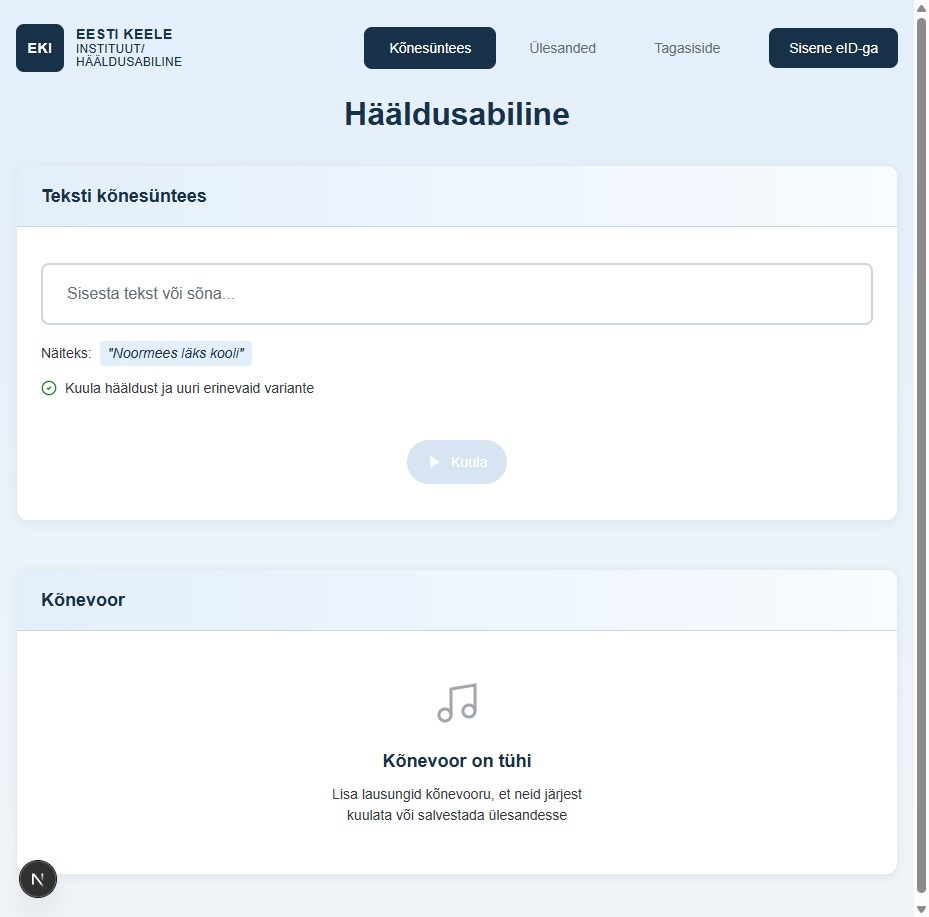

# US-001: Enter and synthesize text

**Feature:** F-001
**Status:** [x] ✅ Implemented in prototype
**Implementation:** `app/page.tsx` (lines 708-857: synthesizeAndPlay, lines 933-1070: synthesizeWithText, lines 1166-1299: UI)

## User Story

As a **language learner**  
I want to **enter Estonian text and receive synthesized audio with correct pronunciation**  
So that **I can learn proper pronunciation and stress patterns**

## Acceptance Criteria

[x] **AC-1:** Tag-based text input
    GIVEN I am on the speech synthesis page
    WHEN I enter Estonian text in the input field
    THEN the text is displayed as interactive tags (words separated by spaces)
    AND I can press Space to create a new tag from the current word
    AND I can press Backspace on empty input to edit the last tag
    AND I can press Enter to synthesize and play the complete text
    _Verified by:_ Tag-based input in sentence-row (page.tsx:1188-1217), handleKeyDown (page.tsx:345-416), handleTextChange (page.tsx:339-343)

[x] **AC-2:** Morphological analysis
    GIVEN I have entered Estonian text
    WHEN I press Enter or click the play button
    THEN the system processes the text through Vabamorf for morphological analysis (if not using cached phonetic text)
    _Verified by:_ `/api/analyze` endpoint (page.tsx:793-805, 1006-1017), Vabamorf service on port 8001

[x] **AC-3:** Stress markers
    GIVEN the text has been processed by Vabamorf
    WHEN the system receives the analyzed text
    THEN stress markers are automatically added to the phonetic text
    AND the phonetic text is cached in the sentence state for reuse
    _Verified by:_ stressedText from `/api/analyze` response (page.tsx:803-804, 1016), phoneticText cached in sentence state (page.tsx:36, 830)

[x] **AC-4:** Speech generation with loading state
    GIVEN the text has stress markers
    WHEN the system sends the phonetic text to Merlin TTS
    THEN the play button immediately shows a loading spinner
    AND natural-sounding Estonian speech is generated with appropriate voice model
    AND the voice model is automatically selected based on word count (efm_s for single words, efm_l for sentences)
    AND the audio is cached as a blob URL for reuse
    _Verified by:_ Loading state set before synthesis (page.tsx:775-781, 988-994), `/api/synthesize` endpoint (page.tsx:807-819, 1021-1032), Merlin TTS service on port 8002, getVoiceModel function (page.tsx:24-27), audio caching (page.tsx:823, 830, 1036, 1043)

[x] **AC-5:** Playback state transition
    GIVEN the play button is showing a loading spinner (from AC-4)
    WHEN the audio generation is complete and audio data is loaded
    THEN the loading spinner disappears
    AND the play button transitions to playing state (showing pause icon)
    AND audio playback begins automatically
    _Verified by:_ State transition on audio.onloadeddata (page.tsx:739-743, 828-832, 952-956, 1041-1045), play button icon states (page.tsx:1220-1238), isPlaying and isLoading state management (page.tsx:34, 544-545, 742-748, 829-831)

[x] **AC-6:** Audio playback control
    GIVEN I have entered text and pressed Enter or clicked the play button
    WHEN the audio is synthesized and playing
    THEN the audio plays automatically with correct pronunciation and stress
    AND the play button displays a pause icon to indicate active playback
    AND clicking the play button again while audio is playing stops the current playback and starts a fresh synthesis
    AND the system uses cached audio for repeated playback of the same unchanged text
    AND when audio playback completes, the play button returns to the normal play icon state
    _Verified by:_ Audio playback (page.tsx:823-850, 1037-1063), stop current audio before new synthesis (page.tsx:712-717, 936-941), cache reuse (page.tsx:722-773, 943-985), play button handler (page.tsx:859-884), audio.onended state reset (page.tsx:745-750, 834-838, 958-963, 1047-1052)

## Screenshot

## Additional Features

The implementation includes several features beyond the core acceptance criteria:

- **Audio caching:** Both phonetic text and audio URLs are cached to avoid redundant API calls (page.tsx:36-38, 722-773)
- **Cache invalidation:** Audio cache is invalidated when text changes or playback fails (page.tsx:365, 382, 408, 752-760, 965-973)
- **Retry logic:** Failed audio playback automatically retries once with cache invalidation (page.tsx:559-577, 587-605)
- **Loading states:** Visual feedback during synthesis with spinner animation (page.tsx:1226-1228)
- **Multiple sentence support:** Can add multiple sentences and manage them as a list (page.tsx:418-423, 1294-1297)
- **Drag-and-drop reordering:** Sentences can be reordered via drag-and-drop (page.tsx:647-701)

## Notes

**Reference prototype:** EKI-ui-prototype speech synthesis workflow
**Edge cases:** Empty text, very long text (>1000 characters), special characters, unsupported languages
