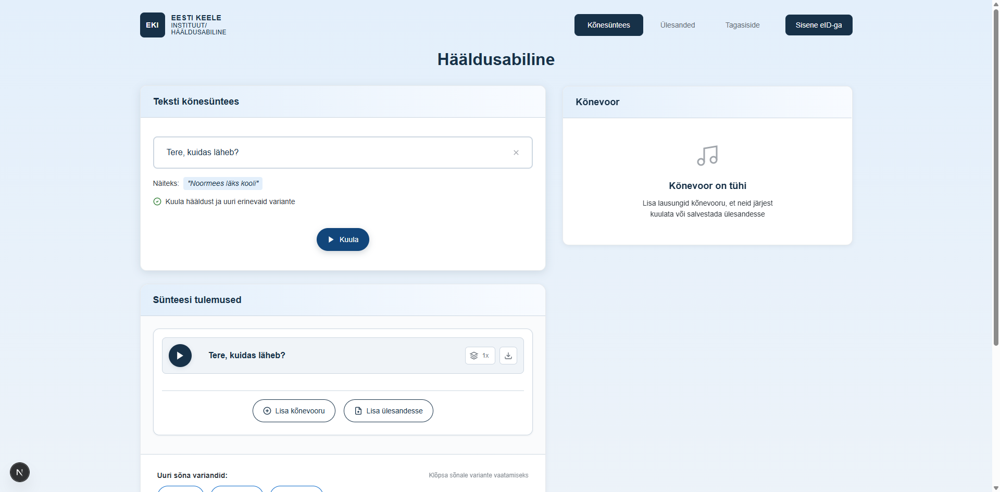

# US-002: Auto-play synthesized audio

**Feature:** F-001
**Status:** [x] ⚠️ DEPRECATED - Merged into US-001
**Implementation:** This functionality is fully covered in US-001 AC-5 and AC-6

## User Story

As a **language learner**  
I want the **synthesized audio to play automatically after generation**  
So that **I can immediately hear the pronunciation without additional clicks**

## Deprecation Notice

This user story has been **merged into US-001** as the autoplay functionality is an integral part of the core synthesis workflow, not a separate feature.

## Original Acceptance Criteria (Now in US-001)

[x] **AC-1:** Auto-play on synthesis completion
→ **Covered by US-001 AC-5:** "AND audio playback begins automatically"
GIVEN the text synthesis is complete
WHEN the audio is generated
THEN the audio player automatically starts playing

[x] **AC-2:** Visual feedback during playback
→ **Covered by US-001 AC-5:** "AND the play button transitions to playing state (showing pause icon)"
→ **Covered by US-001 AC-6:** "AND the play button displays a pause icon to indicate active playback"
GIVEN the audio is auto-playing
WHEN the playback is in progress
THEN the play button shows pause icon

[ ] **AC-3:** Auto-play can be disabled
→ **Not implemented** - No settings UI exists for autoplay toggle
GIVEN the user preferences
WHEN auto-play is disabled in settings
THEN synthesized audio does not play automatically

## Screenshot

## Notes

**Why deprecated:** During implementation, autoplay became an integral part of the synthesis workflow rather than a separate optional feature. The inline playback design in the prototype makes autoplay the natural default behavior.

**Migration:** All functionality described in this user story is now documented in US-001 (Enter and synthesize text).

**Future consideration:** If a settings UI is implemented in the future, AC-3 (autoplay toggle) could be revisited as a new user story for user preferences/settings management.

