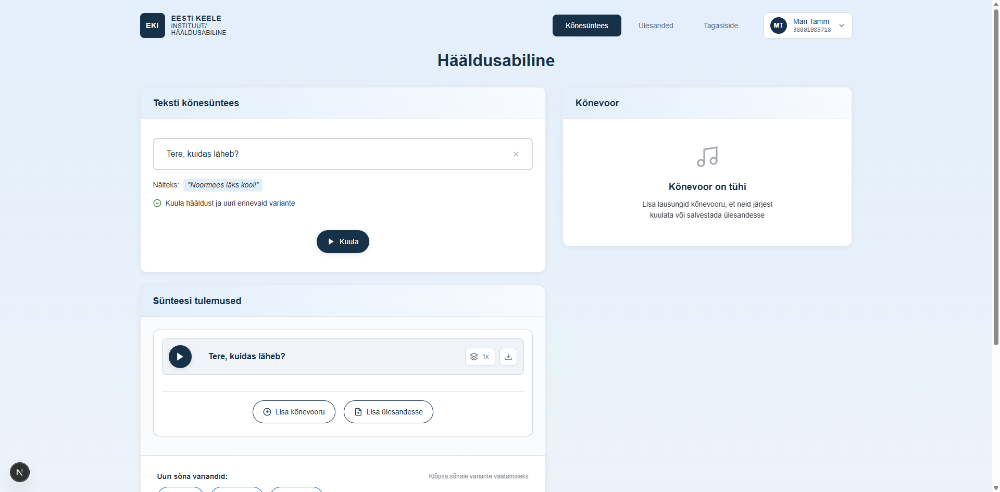

# US-003: Download synthesized audio

**Feature:** F-001
**Status:** [x] ✅ Implemented in prototype
**Implementation:** `app/page.tsx` (lines 452-498: handleDownload, lines 1270-1278: download menu item)

## User Story

As a **language learner**  
I want to **download the synthesized audio file**  
So that **I can listen to it offline or use it in other applications**

## Acceptance Criteria

[x] **AC-1:** Download button availability
GIVEN I have entered text in a sentence row
WHEN I click the three-dots menu button (more options)
THEN a dropdown menu appears with a "Lae alla" (Download) option
AND the download option is enabled only if the sentence has text
_Verified by:_ Download menu item in dropdown (page.tsx:1270-1278), disabled state when no text (page.tsx:1273)

[x] **AC-2:** File download on click
GIVEN the download option is available in the menu
WHEN I click "Lae alla" (Download)
THEN the system checks if audio is already cached
AND if not cached, generates the audio first via synthesis
AND the audio file downloads to my device
AND the dropdown menu closes automatically
_Verified by:_ Download function (page.tsx:452-498), cache check (page.tsx:456-487), download trigger via blob URL and anchor element (page.tsx:490-495), menu close (page.tsx:497)

[x] **AC-3:** File naming convention
GIVEN the audio file is being downloaded
WHEN the download starts
THEN the filename is set to the sentence text with .wav extension
AND if the sentence is empty, defaults to "audio.wav"
_Verified by:_ Filename generation: `${sentence.text || 'audio'}.wav` (page.tsx:492)

[x] **AC-4:** File format
GIVEN the audio file is downloaded
WHEN I check the file
THEN it is in WAV format playable on standard audio players
_Verified by:_ `/api/synthesize` endpoint returns WAV format audio from Merlin TTS, blob created from response (page.tsx:476-477)

## Screenshot

## Additional Features

The implementation includes smart audio caching:
- **Lazy synthesis for download**: Audio is only synthesized when needed for download if not already cached (page.tsx:458-487)
- **Cache reuse**: If audio was previously played and cached, download uses the existing cached audio URL
- **Error handling**: If synthesis fails during download, the operation is aborted and user sees console error (page.tsx:484-486)

## Notes

**Reference prototype:** EKI-ui-prototype audio download functionality
**UI location:** Download is accessed via the three-dots menu (⋮) on each sentence row, not as a standalone button
**Edge cases:** Long text causing large file sizes, browser download restrictions, file naming with special characters
**Filename sanitization:** The implementation does not sanitize special characters from the sentence text when creating filenames, which could cause issues with certain characters (e.g., /, \, :, etc.)

