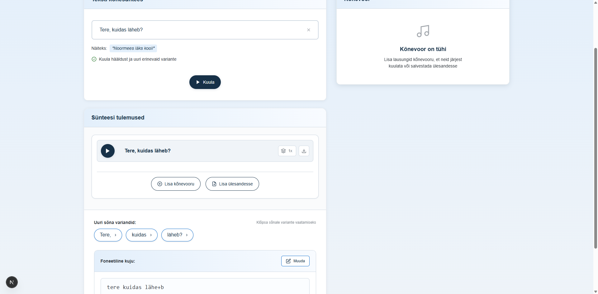

# US-004: View text with stress markers

**Feature:** F-002
**Status:** [ ] ⚠️ PARTIALLY IMPLEMENTED
**Implementation:** `components/StressedTextDisplay.tsx` exists but is NOT integrated into `app/page.tsx`. Phonetic text is stored internally but not displayed to users.

## User Story

As a **language learner**  
I want to **see the Estonian text with stress markers visually indicated**  
So that **I can understand which syllables to emphasize when pronouncing**

## Acceptance Criteria

[ ] **AC-1:** Stress markers displayed
GIVEN the text has been analyzed by Vabamorf
WHEN the synthesis results are shown
THEN stress markers are visible in the phonetic text display
_Status:_ ❌ **NOT IMPLEMENTED** - The UI only shows original text words as tags (page.tsx:1205), not phonetic forms. Phonetic text is stored in `sentence.phoneticText` and `sentence.stressedTags` but never displayed to the user.

[ ] **AC-2:** Visual distinction
GIVEN the stressed text is displayed
WHEN I look at the text
THEN stressed syllables are visually distinct from unstressed ones
_Status:_ ❌ **NOT IMPLEMENTED** - No visual display of stress markers. Tags show original words without phonetic notation.

[ ] **AC-3:** Phonetic notation
GIVEN the stressed text is shown
WHEN I view the phonetic form
THEN it uses Estonian phonetic markers (`, ´, ', +, etc.)
_Status:_ ⚠️ **COMPONENT EXISTS BUT NOT USED** - `StressedTextDisplay.tsx` component (lines 1-315) supports phonetic marker transformation via `transformToUI` and `transformToVabamorf` utilities, but the component is not imported or used in the main app.

## Screenshot

## Implementation Gap

**What exists:**
- ✅ `StressedTextDisplay.tsx` component is fully implemented with features:
  - Display of original text vs phonetic text comparison (lines 108-130)
  - Clickable words to view pronunciation variants
  - Edit mode for manual phonetic text editing (lines 179-250)
  - Phonetic marker toolbar with symbols (`, ´, ', +)
  - Phonetic guide modal integration
  - Transform utilities for marker conversion (`transformToUI`, `transformToVabamorf`)

**What's missing:**
- ❌ Component is not imported or used in `app/page.tsx`
- ❌ Tag display (page.tsx:1205) shows `{tag}` (original text) instead of phonetic form
- ❌ No visual indication of stress markers to users
- ❌ Phonetic data (`sentence.phoneticText`, `sentence.stressedTags`) is stored but hidden

**Current user experience:**
- Users type words → words appear as tags (original form only)
- Users click play → audio is synthesized with stress markers (invisible to user)
- Users click on words → see pronunciation variants panel
- **Users never see the phonetic/stressed form of their own input**

## Notes

**Reference prototype:** EKI-ui-prototype StressedTextDisplay component
**Implementation status:** Component built but not integrated into the UI flow
**Edge cases:** Complex compound words, ambiguous stress patterns, words with multiple valid stress options
**Recommendation:** Integrate `StressedTextDisplay` component into the synthesis page or show phonetic forms in the tags to complete this user story.

