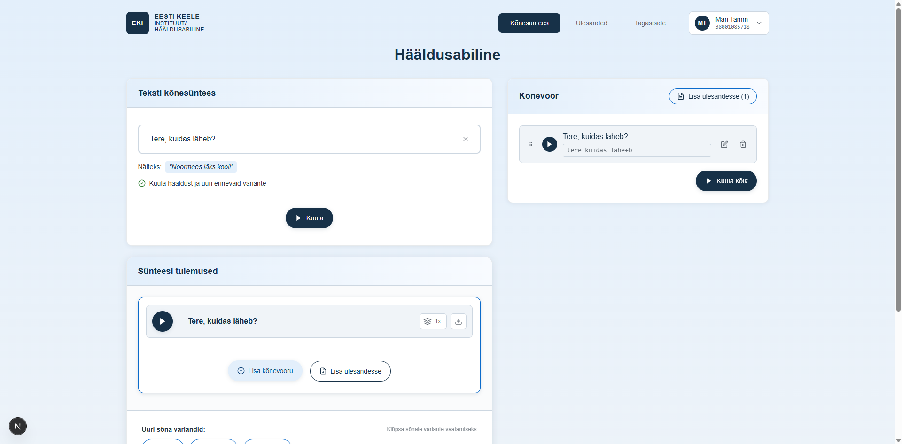

# US-009: Add sentence to synthesis list

**Feature:** F-003
**Status:** [x] ✅ Implemented in prototype
**Implementation:** `app/page.tsx` (lines 418-423: handleAddSentence, lines 1294-1297: "Lisa lause" button)

## User Story

As a **language learner**
I want to **add multiple sentence rows to the synthesis page**
So that **I can prepare and practice several phrases in one session**

## Acceptance Criteria

[x] **AC-1:** Add sentence button
GIVEN I am on the synthesis page
WHEN I click the "Lisa lause" button at the bottom of the sentences section
THEN a new empty sentence row is added to the list
_Verified by:_ handleAddSentence creates new sentence with unique ID (page.tsx:418-423), button visible at bottom (page.tsx:1294-1297)

[x] **AC-2:** New sentence visibility
GIVEN I have clicked the "Lisa lause" button
WHEN the new sentence is created
THEN it immediately appears as an editable row in the sentences list
AND I can start typing text in the new row
_Verified by:_ New sentence appears inline with empty tags array and empty currentInput (page.tsx:420-422)

[x] **AC-3:** Multiple sentences support
GIVEN I have one or more sentence rows
WHEN I add additional sentences
THEN all sentences coexist in the list with unique IDs
AND duplicate text is allowed across different sentence rows
_Verified by:_ Each sentence gets unique ID via Date.now() (page.tsx:420), sentences array can contain multiple entries (page.tsx:32)

## Screenshot

## Notes

**UX Pattern:** Users build a list of sentences to synthesize, rather than adding results to a playlist after synthesis
**No limits:** There is no hard limit on the number of sentence rows (only practical memory constraints)
**Related features:** Works with drag-and-drop reordering (US-013) and "Mängi kõik" sequential playback (US-011)
**Edge cases:** Many sentences may impact performance, array state management in React
