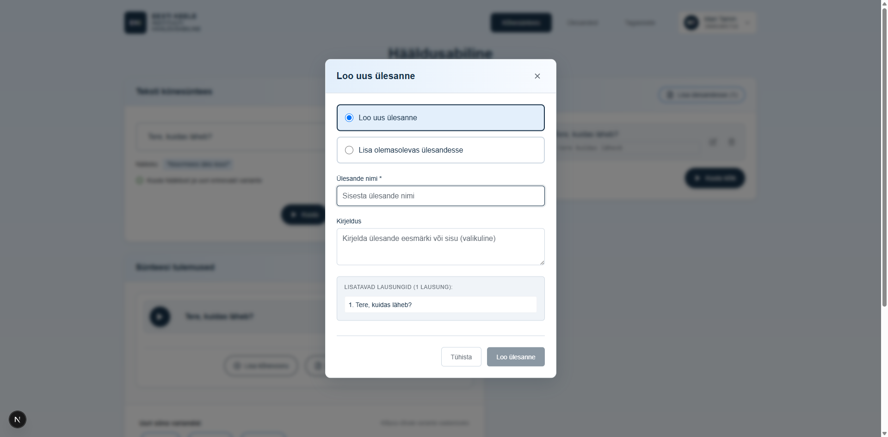

# US-015: Create new task

**Feature:** F-005  
**Status:** [x] ✅ Implemented in prototype  
**Implementation:** `TaskCreationModal.tsx`, `TaskManager.tsx`, `DataService.ts`

## User Story

As a **language teacher**  
I want to **create a new pronunciation task**  
So that **I can organize learning materials for my students**

## Acceptance Criteria

[x] **AC-1:** Create task button  
GIVEN I am authenticated  
WHEN I view the tasks page  
THEN a "Create new task" button is visible  
_Verified by:_ TaskCreationModal with name/description inputs, localStorage persistence

[x] **AC-2:** Task creation form  
GIVEN I click create task button  
WHEN the form opens  
THEN I can enter task name and description  
_Verified by:_ TaskCreationModal with name/description inputs, localStorage persistence

[x] **AC-3:** Task saved  
GIVEN I have filled the task form  
WHEN I click save  
THEN the new task appears in my tasks list  
_Verified by:_ TaskCreationModal with name/description inputs, localStorage persistence

[x] **AC-4:** Required fields validation  
GIVEN I try to create a task  
WHEN task name is empty  
THEN validation error is displayed  
_Verified by:_ TaskCreationModal with name/description inputs, localStorage persistence

## Screenshot

## Notes

**Reference prototype:** EKI-ui-prototype TaskCreationModal component  
**Edge cases:** Duplicate task names, very long descriptions, special characters in task names

