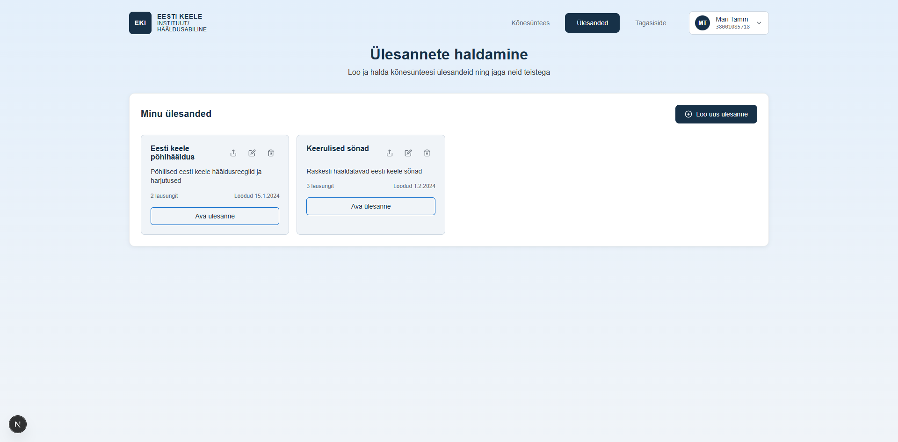

# US-016: View task list

**Feature:** F-004  
**Status:** [x] ✅ Implemented in prototype  
**Implementation:** `TaskManager.tsx`, view switching in `app/page.tsx`

## User Story

As a **language teacher**  
I want to **view all my created tasks**  
So that **I can manage and access my pronunciation exercises**

## Acceptance Criteria

[x] **AC-1:** Tasks page navigation  
GIVEN I am authenticated  
WHEN I navigate to tasks section  
THEN I see a list of all my tasks  
_Verified by:_ TaskManager displays task cards with metadata, entry count, actions

[x] **AC-2:** Task card information  
GIVEN tasks are displayed  
WHEN I view a task card  
THEN I see task name, description, entry count, and creation date  
_Verified by:_ TaskManager displays task cards with metadata, entry count, actions

[x] **AC-3:** Empty state  
GIVEN I have no tasks  
WHEN I view the tasks page  
THEN I see an empty state with instructions to create first task  
_Verified by:_ TaskManager displays task cards with metadata, entry count, actions

[x] **AC-4:** Task sorting  
GIVEN I have multiple tasks  
WHEN I view the list  
THEN tasks are sorted by creation date (newest first)  
_Verified by:_ TaskManager displays task cards with metadata, entry count, actions

## Screenshot

## Notes

**Reference prototype:** EKI-ui-prototype TaskManager component  
**Edge cases:** Large number of tasks pagination, task loading errors, filtering and search

