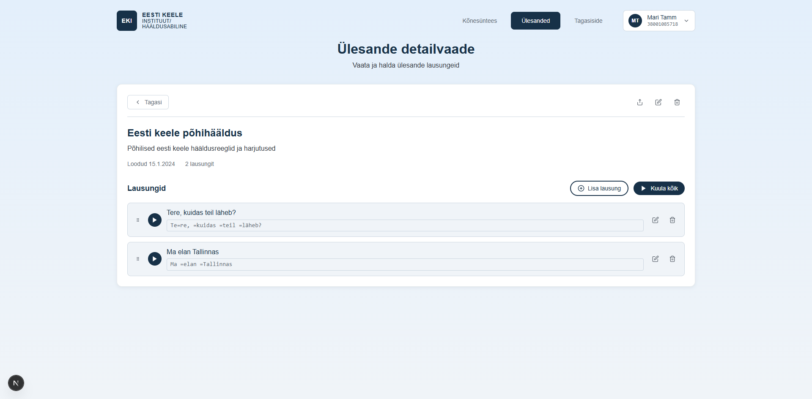

# US-017: View task details

**Feature:** F-004  
**Status:** [x] ✅ Implemented in prototype  
**Implementation:** `TaskDetailView.tsx`

## User Story

As a **language teacher**  
I want to **view detailed information about a specific task**  
So that **I can review and manage its content**

## Acceptance Criteria

[x] **AC-1:** Task detail navigation  
GIVEN I am viewing the tasks list  
WHEN I click on a task  
THEN I see the detailed view of that task  
_Verified by:_ TaskDetailView with full task metadata, entries list, actions

[x] **AC-2:** Task information display  
GIVEN I am in task detail view  
WHEN the page loads  
THEN I see task name, description, creation date, and entry count  
_Verified by:_ TaskDetailView with full task metadata, entries list, actions

[x] **AC-3:** Entries list display  
GIVEN the task contains entries  
WHEN I view task details  
THEN all entries are listed with text and phonetic form  
_Verified by:_ TaskDetailView with full task metadata, entries list, actions

[x] **AC-4:** Play all entries option  
GIVEN the task has multiple entries  
WHEN I view task details  
THEN a "Play all" button is available  
_Verified by:_ TaskDetailView with full task metadata, entries list, actions

## Screenshot

## Notes

**Reference prototype:** EKI-ui-prototype TaskDetailView component  
**Edge cases:** Tasks with many entries, empty tasks, loading states

