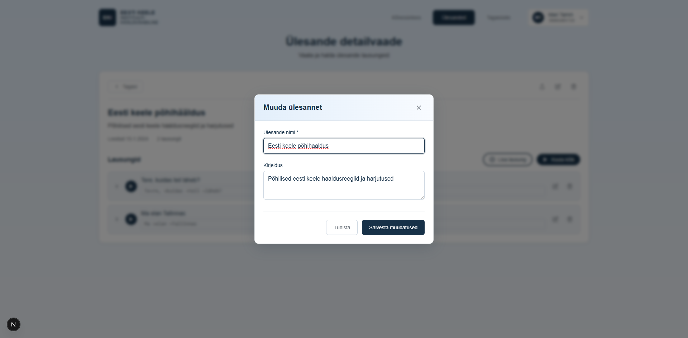

# US-018: Edit task metadata

**Feature:** F-005  
**Status:** [x] ✅ Implemented in prototype  
**Implementation:** `TaskEditModal.tsx`

## User Story

As a **language teacher**  
I want to **edit task name and description**  
So that **I can update task information as needed**

## Acceptance Criteria

[x] **AC-1:** Edit button display  
GIVEN I am viewing task details  
WHEN the page loads  
THEN I see an "Edit" button for the task  
_Verified by:_ TaskEditModal for name/description updates

[x] **AC-2:** Edit form display  
GIVEN I am viewing a task  
WHEN I click the "Edit" button  
THEN I see a form with task name and description fields pre-filled  
_Verified by:_ TaskEditModal for name/description updates

[x] **AC-3:** Save changes  
GIVEN I have modified task name or description  
WHEN I click "Save"  
THEN the task is updated with new information  
_Verified by:_ TaskEditModal for name/description updates

[x] **AC-4:** Cancel editing  
GIVEN I am editing a task  
WHEN I click "Cancel"  
THEN changes are discarded and I return to task view  
_Verified by:_ TaskEditModal for name/description updates

[x] **AC-5:** Validation  
GIVEN I am editing a task  
WHEN I try to save with empty name  
THEN I see a validation error and cannot save  
_Verified by:_ TaskEditModal for name/description updates

## Screenshot

## Notes

**Reference prototype:** EKI-ui-prototype task editing functionality  
**Edge cases:** Empty name, very long text, concurrent edits

