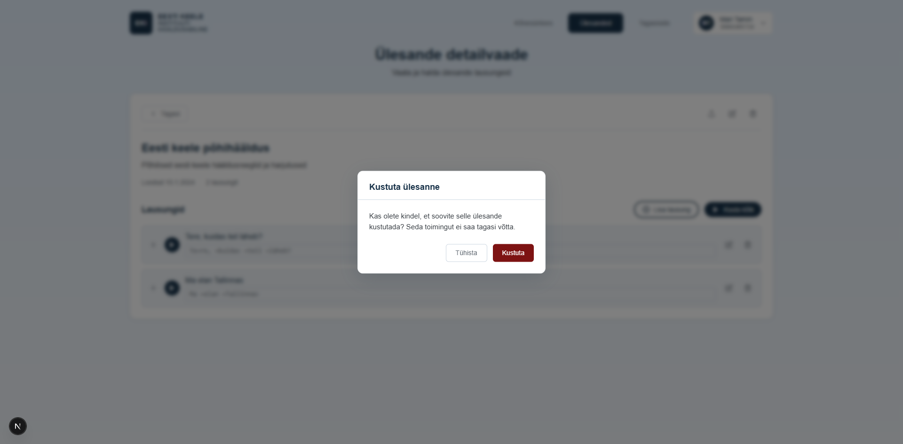

# US-019: Delete task

**Feature:** F-005  
**Status:** [x] ✅ Implemented in prototype  
**Implementation:** `ConfirmationModal.tsx`, `TaskManager.tsx`

## User Story

As a **language teacher**  
I want to **delete tasks I no longer need**  
So that **I can keep my task list organized**

## Acceptance Criteria

[x] **AC-1:** Delete button display  
GIVEN I am viewing task details  
WHEN the page loads  
THEN I see a "Delete" button for the task  
_Verified by:_ ConfirmationModal with task name confirmation before deletion

[x] **AC-2:** Confirmation dialog  
GIVEN I click the "Delete" button  
WHEN the button is clicked  
THEN I see a confirmation dialog asking to confirm deletion  
_Verified by:_ ConfirmationModal with task name confirmation before deletion

[x] **AC-3:** Confirm deletion  
GIVEN the confirmation dialog is displayed  
WHEN I confirm deletion  
THEN the task is permanently deleted from the database  
_Verified by:_ ConfirmationModal with task name confirmation before deletion

[x] **AC-4:** Cancel deletion  
GIVEN the confirmation dialog is displayed  
WHEN I click "Cancel"  
THEN the task is not deleted and dialog closes  
_Verified by:_ ConfirmationModal with task name confirmation before deletion

[x] **AC-5:** Redirect after deletion  
GIVEN I have confirmed task deletion  
WHEN the task is deleted  
THEN I am redirected to the tasks list  
_Verified by:_ ConfirmationModal with task name confirmation before deletion

## Screenshot

## Notes

**Reference prototype:** EKI-ui-prototype task deletion with confirmation  
**Edge cases:** Task with many entries, shared tasks, network errors during deletion

