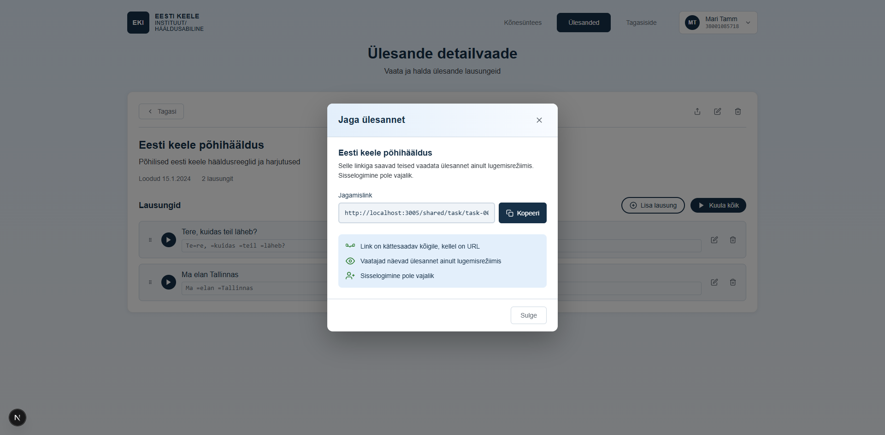

# US-023: Access shared task via link

**Feature:** F-006  
**Status:** [x] ✅ Implemented in prototype  
**Implementation:** `app/page.tsx`, `TaskDetailView.tsx`, URL routing

## User Story

As a **language student**  
I want to **access a task via a shared link**  
So that **I can complete exercises assigned by my teacher**

## Acceptance Criteria

[x] **AC-1:** Open shared link  
GIVEN I have a task share link  
WHEN I open the URL in my browser  
THEN I see the shared task details  
_Verified by:_ Share link opens read-only task view, copy to playlist functionality

[x] **AC-2:** Read-only view  
GIVEN I am viewing a shared task  
WHEN the page loads  
THEN I can see all entries but cannot edit or delete the task  
_Verified by:_ Share link opens read-only task view, copy to playlist functionality

[x] **AC-3:** Play audio entries  
GIVEN the shared task has audio entries  
WHEN I view the task  
THEN I can play all audio files  
_Verified by:_ Share link opens read-only task view, copy to playlist functionality

[x] **AC-4:** Copy to my tasks  
GIVEN I am authenticated and viewing a shared task  
WHEN I click "Copy to my tasks"  
THEN a copy of the task is added to my own task list  
_Verified by:_ Share link opens read-only task view, copy to playlist functionality

[x] **AC-5:** Access without authentication  
GIVEN I am not logged in  
WHEN I open a share link  
THEN I can still view and play the task content  
_Verified by:_ Share link opens read-only task view, copy to playlist functionality

## Screenshot

## Notes

**Reference prototype:** EKI-ui-prototype shared task view  
**Edge cases:** Invalid links, expired links, deleted tasks

