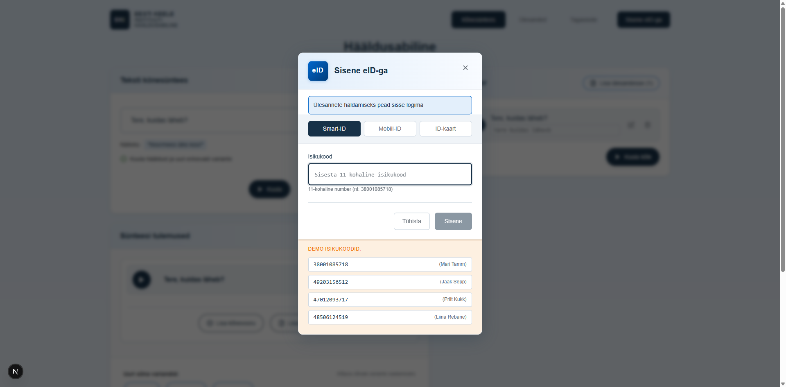

# US-025: Login with eID

**Feature:** F-008  
**Status:** [x] ✅ Implemented in prototype (UI stub)  
**Implementation:** `LoginModal.tsx`, `AuthContext.tsx`, mock validation

## User Story

As a **registered user**  
I want to **log in using my Estonian eID (isikukood)**  
So that **I can access task management and personalized features**

## Acceptance Criteria

[x] **AC-1:** Login button display  
GIVEN I am not authenticated  
WHEN I visit the application  
THEN I see a "Login" or "Logi sisse" button  
_Verified by:_ LoginModal with Smart-ID/Mobiil-ID/ID-kaart tabs, isikukood validation (backend integration pending)

[x] **AC-2:** eID authentication form  
GIVEN I click the login button  
WHEN the button is clicked  
THEN I see an authentication form asking for my isikukood  
_Verified by:_ LoginModal with Smart-ID/Mobiil-ID/ID-kaart tabs, isikukood validation (backend integration pending)

[x] **AC-3:** Isikukood validation  
GIVEN I enter my isikukood  
WHEN I submit the form  
THEN the system validates the format of the isikukood  
_Verified by:_ LoginModal with Smart-ID/Mobiil-ID/ID-kaart tabs, isikukood validation (backend integration pending)

[x] **AC-4:** Successful authentication  
GIVEN I have entered a valid isikukood  
WHEN authentication succeeds  
THEN I am logged in and see my profile information  
_Verified by:_ LoginModal with Smart-ID/Mobiil-ID/ID-kaart tabs, isikukood validation (backend integration pending)

[x] **AC-5:** Session persistence  
GIVEN I have successfully logged in  
WHEN I refresh the page or return later  
THEN I remain authenticated until I explicitly log out  
_Verified by:_ LoginModal with Smart-ID/Mobiil-ID/ID-kaart tabs, isikukood validation (backend integration pending)

[x] **AC-6:** Error handling  
GIVEN I enter an invalid isikukood  
WHEN I submit the form  
THEN I see an error message explaining the issue  
_Verified by:_ LoginModal with Smart-ID/Mobiil-ID/ID-kaart tabs, isikukood validation (backend integration pending)

## Screenshot

## Notes

**Reference prototype:** EKI-ui-prototype AuthContext and login flow  
**Edge cases:** Network errors, invalid isikukood format, session expiration

