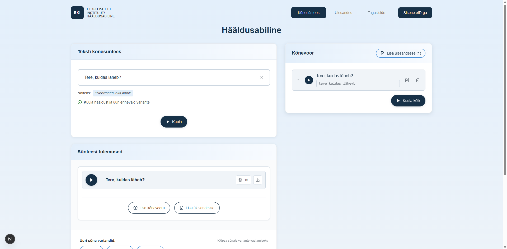

# US-027: Logout from system

**Feature:** F-008  
**Status:** [x] ✅ Implemented in prototype  
**Implementation:** `UserProfile.tsx`, `AuthContext.tsx`

## User Story

As an **authenticated user**  
I want to **log out of the application**  
So that **I can secure my account when done**

## Acceptance Criteria

[x] **AC-1:** Logout button display  
GIVEN I am logged in  
WHEN I view the navigation or profile menu  
THEN I see a "Logout" or "Logi välja" button  
_Verified by:_ Logout clears session, redirects to synthesis view

[x] **AC-2:** Logout action  
GIVEN I click the logout button  
WHEN the button is clicked  
THEN my session is terminated  
_Verified by:_ Logout clears session, redirects to synthesis view

[x] **AC-3:** Redirect after logout  
GIVEN I have logged out  
WHEN the logout completes  
THEN I am redirected to the home page  
_Verified by:_ Logout clears session, redirects to synthesis view

[x] **AC-4:** Session cleanup  
GIVEN I have logged out  
WHEN I try to access protected features  
THEN I am prompted to log in again  
_Verified by:_ Logout clears session, redirects to synthesis view

[x] **AC-5:** Confirmation message  
GIVEN I have successfully logged out  
WHEN logout completes  
THEN I see a confirmation message  
_Verified by:_ Logout clears session, redirects to synthesis view

## Screenshot

## Notes

**Reference prototype:** EKI-ui-prototype logout functionality  
**Edge cases:** Logout during task editing, network errors during logout

