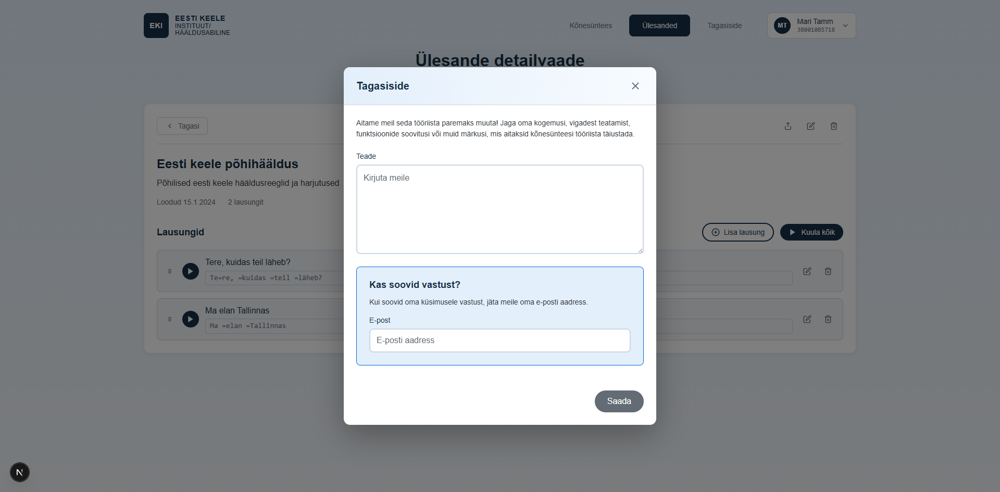

# US-029: Submit feedback

**Feature:** F-009  
**Status:** [x] ✅ Implemented in prototype (UI only)  
**Implementation:** `FeedbackModal.tsx`, `Footer.tsx`

## User Story

As a **user of the application**  
I want to **submit feedback about the platform**  
So that **I can report issues or suggest improvements**

## Acceptance Criteria

[x] **AC-1:** Feedback button display  
GIVEN I am using the application  
WHEN I view the interface  
THEN I see a "Feedback" or "Tagasiside" button or link  
_Verified by:_ FeedbackModal with message/email inputs (backend email service pending)

[x] **AC-2:** Feedback form display  
GIVEN I click the feedback button  
WHEN the button is clicked  
THEN I see a form with message field and optional email field  
_Verified by:_ FeedbackModal with message/email inputs (backend email service pending)

[x] **AC-3:** Submit feedback  
GIVEN I have entered feedback message  
WHEN I click "Submit"  
THEN my feedback is sent to the system  
_Verified by:_ FeedbackModal with message/email inputs (backend email service pending)

[x] **AC-4:** Confirmation message  
GIVEN I have submitted feedback  
WHEN submission succeeds  
THEN I see a "Thank you" confirmation message  
_Verified by:_ FeedbackModal with message/email inputs (backend email service pending)

[x] **AC-5:** Optional email  
GIVEN I am filling the feedback form  
WHEN I view the form  
THEN the email field is clearly marked as optional  
_Verified by:_ FeedbackModal with message/email inputs (backend email service pending)

## Screenshot

## Notes

**Reference prototype:** EKI-ui-prototype feedback form component  
**Edge cases:** Empty message, very long messages, spam prevention

