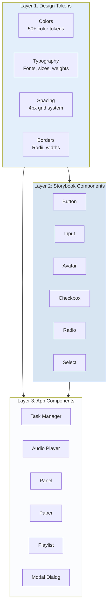
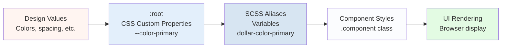
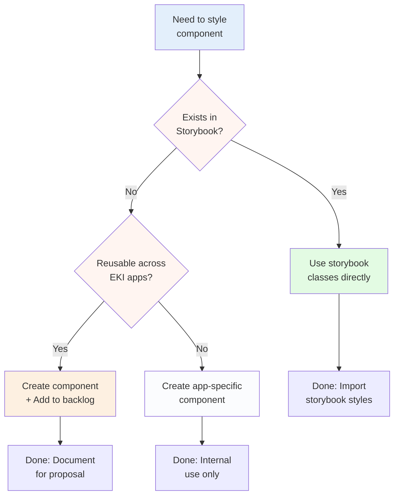
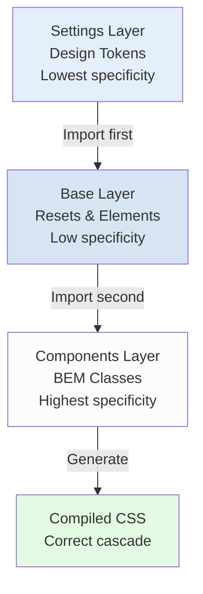

# Architecture Diagrams

## Three-Layer Architecture

**Description:**
- **Layer 1** provides all design values (tokens)
- **Layer 2** imports shared components from storybook
- **Layer 3** builds app-specific functionality on top
- Tokens flow down through all layers
- Lower layers can use upper layers, never the reverse

## Token System Flow

**Description:**
- Design values defined once
- CSS custom properties enable runtime theming
- SCSS aliases provide compile-time benefits
- Components reference aliases
- Browser renders using CSS variables

## Component Creation Decision Tree

**Description:**
- Always check storybook first
- Use existing components when possible
- Create new components following standards
- Document reusable components for storybook
- Keep app-specific components internal

## ITCSS Import Order

**Description:**
- Settings (tokens) imported first
- Base styles use tokens
- Components use tokens and base styles
- Specificity increases down the triangle
- Import order enforced in main.scss

## Summary

The EKI Design System provides a robust, scalable architecture for building consistent user interfaces. Key takeaways:

1. **Three Layers**: Tokens → Storybook → App Components
2. **Design Tokens**: Single source of truth for all values
3. **BEM Methodology**: Consistent, predictable component naming
4. **Quality Standards**: Enforced through validation scripts
5. **Storybook Integration**: Reuse shared components, propose improvements

For quick reference, see [`DESIGN_SYSTEM_QUICK_REFERENCE.md`](DESIGN_SYSTEM_QUICK_REFERENCE.md).

For onboarding, see [`DESIGN_SYSTEM_ONBOARDING.md`](DESIGN_SYSTEM_ONBOARDING.md).

---

**Questions or Issues?**

- Token governance: [`styles/tokens/README.md`](../styles/tokens/README.md)
- Style guide: [`styles/README.md`](../styles/README.md)
- Component proposals: [`STORYBOOK-BACKLOG.md`](STORYBOOK-BACKLOG.md)
- Validation: `npm run validate:design`
