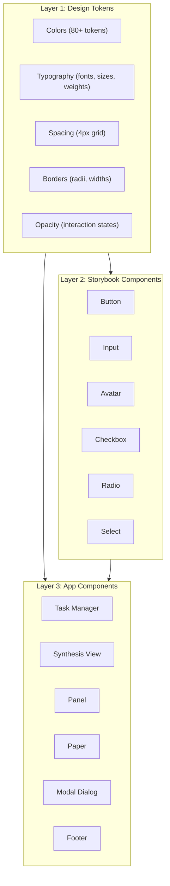
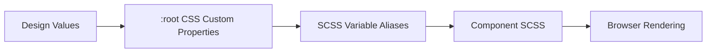
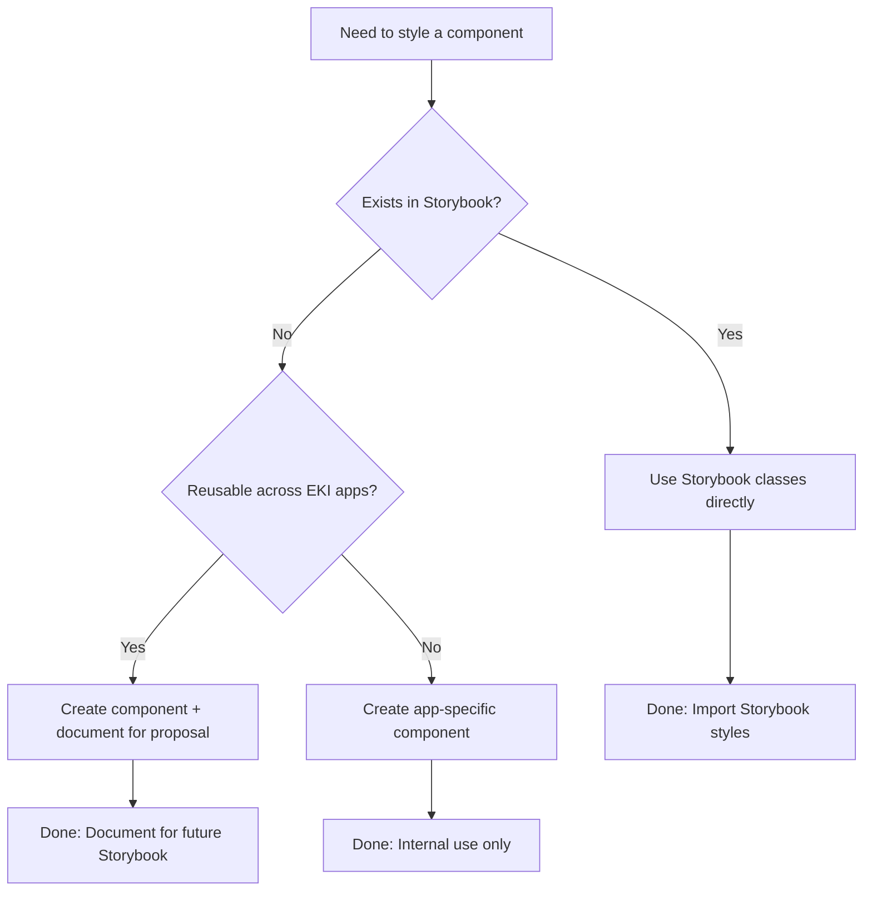
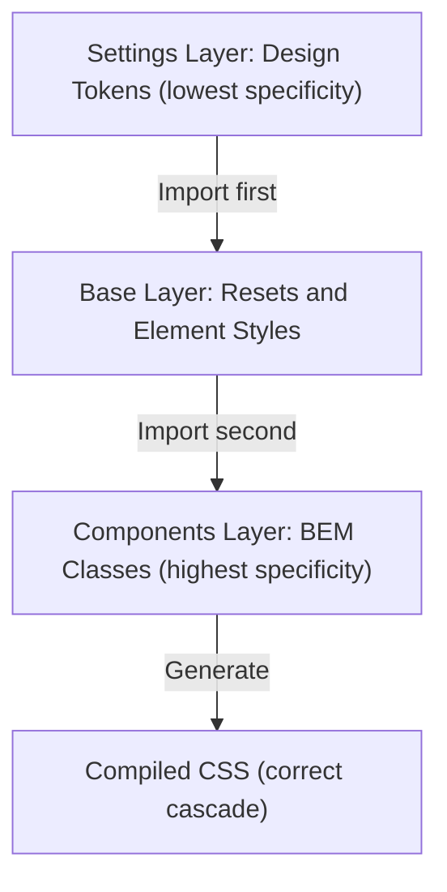

# Architecture Diagrams

## Three-Layer Architecture

- **Layer 1** provides all design values (tokens)
- **Layer 2** imports shared components from EKI Storybook
- **Layer 3** builds app-specific functionality on top
- Tokens flow down through all layers
- Lower layers can use upper layers, never the reverse

## Token System Flow

- Design values are defined once in token files
- CSS custom properties enable runtime theming
- SCSS aliases provide compile-time IDE autocomplete
- Components reference SCSS aliases exclusively
- Browser resolves CSS variables at render time

## Component Decision Tree

- Always check Storybook first
- Use existing components when possible
- Create new components following BEM and token standards
- Document reusable components for potential Storybook inclusion

## ITCSS Import Order

- Settings (tokens) are imported first
- Base styles use tokens for resets
- Components use tokens and base styles
- Specificity increases down the triangle
- Import order is enforced in `main.scss`

---

## Summary

1. **Three Layers**: Tokens -> Storybook -> App Components
2. **Design Tokens**: Single source of truth for all values
3. **BEM Methodology**: Consistent, predictable component naming
4. **ITCSS**: Import order ensures correct cascade
5. **Storybook Integration**: Reuse shared components, propose improvements
