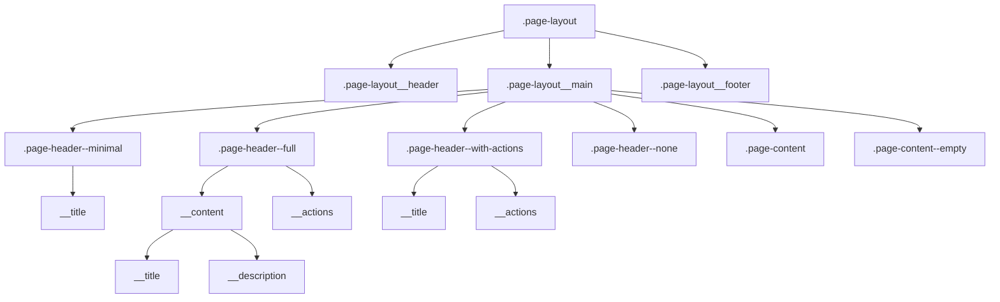
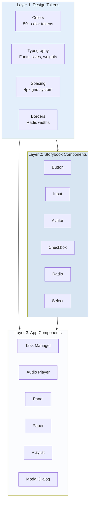
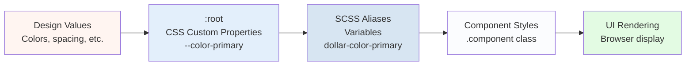
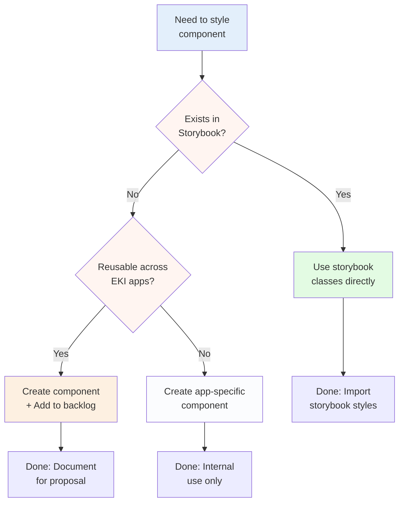
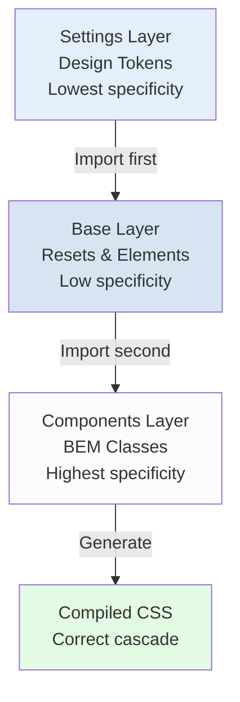

# EKI Design System Architecture

**Version:** 1.0  
**Last Updated:** January 2026  
**Status:** Production Ready

---

## Table of Contents

1. [Introduction](#introduction)
2. [Three-Layer Architecture](#three-layer-architecture)
3. [ITCSS Methodology](#itcss-methodology)
4. [File Structure](#file-structure)
5. [Design Token System](#design-token-system)
6. [Component Architecture](#component-architecture)
7. [Responsive Layout System](#responsive-layout-system)
8. [Development Workflows](#development-workflows)
9. [Quality Standards](#quality-standards)
10. [Migration Patterns](#migration-patterns)
11. [Architecture Diagrams](#architecture-diagrams)

---

## Introduction

### Purpose and Scope

The EKI Design System provides a comprehensive, scalable, and maintainable approach to styling the Estonian pronunciation learning platform. This document serves as the definitive architectural guide for developers implementing or updating the application.

### Philosophy: Design Tokens as Single Source of Truth

Our design system is built on a fundamental principle: **all design values originate from design tokens**. This approach ensures:

- **Consistency**: Visual elements share common design language
- **Maintainability**: Changes propagate through token updates
- **Scalability**: New components inherit established patterns
- **Themability**: Runtime CSS custom properties enable dynamic theming

### Relationship to EKI Storybook

The EKI Design System **extends, not replaces** the central EKI Storybook:

```
EKI Storybook (Shared)          EKI App Design System (Local)
├─ Base components              ├─ Design tokens (extends storybook)
│  └─ Button, Input, Avatar     ├─ App-specific components
└─ Shared patterns              │  └─ Task Manager, Audio Player, Panel
                                └─ Component proposals (for future storybook)
```

**Key Principles:**
- Use storybook components when available
- Follow storybook conventions for consistency
- Document app-specific components for future centralization
- Maintain compatibility for seamless migration

### Target Audience

This documentation is for:
- **Frontend Developers**: Implementing features and components
- **UI/UX Designers**: Understanding implementation constraints
- **Maintainers**: Ensuring architectural consistency
- **New Team Members**: Onboarding to the system

---

## Three-Layer Architecture

The design system follows a three-layer architecture pattern:

```
┌─────────────────────────────────────────────────────────────────┐
│ Layer 1: Design Tokens (styles/tokens/)                        │
│ ─────────────────────────────────────────────────────────────── │
│ Single source of truth for all design values                   │
│ • Colors (50+ tokens)                                           │
│ • Typography (fonts, sizes, weights, line heights)             │
│ • Spacing (4px grid system)                                     │
│ • Borders (radii, widths)                                       │
└─────────────────────────────────────────────────────────────────┘
                           ↓
┌─────────────────────────────────────────────────────────────────┐
│ Layer 2: Storybook Components (imported)                       │
│ ─────────────────────────────────────────────────────────────── │
│ Shared components from EKI Storybook (used as-is)              │
│ • Button, Input, Avatar                                         │
│ • Checkbox, Radio, Select                                       │
│ • Modal (notifications)                                         │
└─────────────────────────────────────────────────────────────────┘
                           ↓
┌─────────────────────────────────────────────────────────────────┐
│ Layer 3: App-Specific Components (styles/components/)          │
│ ─────────────────────────────────────────────────────────────── │
│ Components unique to this application                           │
│ • Task Manager, Audio Player, Playlist                          │
│ • Panel (sliding drawers), Paper (dropdowns)                    │
│ • Modal (dialogs), Textarea                                     │
│ • Phonetic displays, Synthesis results                          │
└─────────────────────────────────────────────────────────────────┘
```

**Layer Responsibilities:**

- **Layer 1** provides values
- **Layer 2** provides base UI patterns
- **Layer 3** provides app-specific functionality

**Dependencies:**
- Layer 2 depends on Layer 1
- Layer 3 depends on Layers 1 and 2
- Layers never depend upward

---

## ITCSS Methodology

The design system implements [ITCSS (Inverted Triangle CSS)](https://www.xfive.co/blog/itcss-scalable-maintainable-css-architecture/) methodology:

```
        ┌─────────────────┐
        │    Settings     │  ← Tokens (most generic, widest reach)
        ├─────────────────┤
        │      Base       │  ← Resets, element defaults
        ├─────────────────┤
        │   Components    │  ← BEM components (most specific)
        └─────────────────┘
```

### Settings Layer (Tokens)

**Location:** `styles/tokens/`

- CSS custom properties in `:root`
- SCSS variable aliases
- No actual styling, just values
- Highest reusability, lowest specificity

### Base Layer

**Location:** `styles/base/`

- CSS resets
- Base element styles (body, html)
- Normalizations
- No classes, just element selectors

### Components Layer

**Location:** `styles/components/`

- BEM-named classes
- Specific component styles
- Highest specificity, lowest reusability
- Each component in its own file

### Import Order Importance

The order of imports in `styles/main.scss` is **critical**:

```scss
// 1. Tokens FIRST (provide values)
@import 'tokens/colors';
@import 'tokens/typography';
@import 'tokens/spacing';
@import 'tokens/borders';

// 2. Storybook imports (optional overrides)
@import 'abstracts/storybook-imports';

// 3. Base styles (element defaults)
@import 'base/reset';

// 4. Components LAST (specific styles)
@import 'components/panel';
@import 'components/paper';
// ... more components
```

**Why this order matters:**
- Tokens must be defined before use
- Base styles use tokens
- Components use tokens and may extend base styles
- Specificity increases from top to bottom

---

## File Structure

```
styles/
├── tokens/                    # Layer 1: Design Tokens
│   ├── _index.scss           # Barrel export (optional)
│   ├── _colors.scss          # Color tokens (50+ colors)
│   ├── _typography.scss      # Font tokens
│   ├── _spacing.scss         # Spacing scale (4px grid)
│   ├── _borders.scss         # Border radii and widths
│   └── README.md             # Token governance documentation
│
├── abstracts/                 # Storybook-specific imports
│   └── _storybook-imports.scss  # Storybook CSS var references
│
├── base/                      # Base/reset styles
│   └── _reset.scss           # CSS reset and normalizations
│
├── components/                # Layer 3: App-specific components
│   ├── _panel.scss           # Sliding panel component
│   ├── _paper.scss           # Dropdown/popover surface
│   ├── _modal-base.scss      # Dialog modal base
│   ├── _audio-player.scss    # Audio playback
│   ├── _playlist.scss        # Playlist component
│   ├── _task-manager.scss    # Task management UI
│   ├── _textarea.scss        # Textarea component
│   └── ... (32 component files)
│
├── main.scss                  # Entry point (imports all)
└── README.md                  # Style guide and BEM documentation
```

**Naming Conventions:**
- Tokens: `_category-name.scss` (e.g., `_colors.scss`)
- Components: `_component-name.scss` (e.g., `_task-manager.scss`)
- Partials: Prefix with underscore `_` (SCSS convention)
- Main: `main.scss` (no underscore, compiled entry)

---

## Design Token System

### Dual-Layer Token System

Our token system uses a **dual-layer approach** combining CSS custom properties with SCSS variables:

```scss
// Layer 1: CSS Custom Properties (runtime-changeable)
:root {
  --color-primary: #173148;
  --color-secondary: #D7E5F2;
  --spacing-md: 1rem;
}

// Layer 2: SCSS Aliases (compile-time, IDE autocomplete)
$color-primary: var(--color-primary);
$color-secondary: var(--color-secondary);
$spacing-md: var(--spacing-md);
```

**Why Dual-Layer?**

| Feature | CSS Custom Properties | SCSS Variables |
|---------|----------------------|----------------|
| Runtime changes | ✅ Yes (theming) | ❌ No (compile-time) |
| IDE autocomplete | ⚠️ Limited | ✅ Excellent |
| Browser cascade | ✅ Yes | ❌ No |
| Performance | ✅ Fast | ✅ Fast |
| Our approach | Define once | Reference everywhere |

**When to use each:**
- **Always use SCSS aliases** in component styles
- **CSS vars enable** runtime theming if needed later
- **Never hardcode** values directly

### Token Categories

#### 1. Colors (`styles/tokens/_colors.scss`)

**50+ color tokens organized by purpose:**

```scss
// Brand colors
$color-primary: var(--color-primary);         // #173148 (dark blue)
$color-secondary: var(--color-secondary);     // #D7E5F2 (light blue)

// Text colors
$color-text-primary: var(--color-text-primary);
$color-text-secondary: var(--color-text-secondary);
$color-text-placeholder: var(--color-text-placeholder);

// Status colors
$color-error: var(--color-error);
$color-warning: var(--color-warning);
$color-success: var(--color-success);

// Component-specific
$color-tag-bg: var(--color-tag-bg);
$color-menu-hover: var(--color-menu-hover);
$color-input-bg-light: var(--color-input-bg-light);
```

#### 2. Typography (`styles/tokens/_typography.scss`)

```scss
// Font families
$font-body: var(--font-body);                // 'Inter', sans-serif

// Font sizes (16px base)
$font-size-xs: var(--font-size-xs);         // 12px
$font-size-sm: var(--font-size-sm);         // 14px
$font-size-md: var(--font-size-md);         // 16px
$font-size-lg: var(--font-size-lg);         // 18px

// Font weights
$font-weight-regular: var(--font-weight-regular);    // 400
$font-weight-medium: var(--font-weight-medium);      // 500
$font-weight-semibold: var(--font-weight-semibold);  // 600
$font-weight-bold: var(--font-weight-bold);          // 700
```

#### 3. Spacing (`styles/tokens/_spacing.scss`)

**4px grid system:**

```scss
$spacing-0: var(--spacing-0);      // 0
$spacing-1: var(--spacing-1);      // 4px
$spacing-2: var(--spacing-2);      // 8px
$spacing-3: var(--spacing-3);      // 12px
$spacing-4: var(--spacing-4);      // 16px
$spacing-6: var(--spacing-6);      // 24px
$spacing-8: var(--spacing-8);      // 32px

// Semantic aliases
$spacing-xs: var(--spacing-xs);    // 4px
$spacing-sm: var(--spacing-sm);    // 8px
$spacing-md: var(--spacing-md);    // 16px
$spacing-lg: var(--spacing-lg);    // 24px
$spacing-xl: var(--spacing-xl);    // 32px
```

#### 4. Borders (`styles/tokens/_borders.scss`)

```scss
// Border radii
$border-radius-sm: var(--border-radius-sm);      // 6px
$border-radius: var(--border-radius);            // 8px
$border-radius-lg: var(--border-radius-lg);      // 12px
$border-radius-round: var(--border-radius-round); // 10rem

// Border widths
$border-width-thin: var(--border-width-thin);    // 1px
$border-width-medium: var(--border-width-medium); // 2px
```

### Naming Convention

**Pattern:** `$[category]-[property]-[variant]-[state]`

**Examples:**
- `$color-primary` - Base primary color
- `$color-text-secondary` - Secondary text color
- `$color-soft-primary-bg` - Soft primary background
- `$color-outlined-danger-hover` - Outlined danger hover state
- `$spacing-md` - Medium spacing
- `$font-size-lg` - Large font size

**Rules:**
- ✅ **Semantic names**: `$color-error` (meaning-based)
- ❌ **Descriptive names**: `$color-red-500` (appearance-based)
- ✅ **Consistent prefixes**: All colors start with `$color-`
- ✅ **Kebab-case**: `$color-text-placeholder` not `$colorTextPlaceholder`

### Token Governance

For detailed guidelines on when and how to add tokens, see [`styles/tokens/README.md`](../styles/tokens/README.md).

**Quick Reference:**

**Add a token when:**
- Value used in 2+ places
- Value has semantic meaning
- Value may need theming

**Don't add a token for:**
- One-off values
- Purely decorative values
- Component-specific values

---

## Component Architecture

### BEM Methodology

All components follow the **BEM (Block Element Modifier)** naming methodology for predictable, maintainable CSS.

**BEM Structure:**

```scss
.block {}                    // Component root
.block__element {}           // Child element (double underscore)
.block--modifier {}          // Variant/state (double dash)
.block__element--modifier {} // Element variant
```

**Real Examples from the App:**

```scss
// Panel Component
.panel {}                    // Block
.panel__backdrop {}          // Element
.panel__header {}            // Element
.panel__title {}             // Element
.panel--right {}             // Modifier (position)
.panel--md {}                // Modifier (size)
.panel__close {}             // Element

// Paper Component
.paper {}                    // Block
.paper__item {}              // Element
.paper__divider {}           // Element
.paper--dropdown {}          // Modifier (type)
.paper--elevated {}          // Modifier (elevation)
.paper__item--danger {}      // Element modifier

// Task Manager
.task-manager {}             // Block
.task-manager__header {}     // Element
.task-manager__list {}       // Element
.task-manager--loading {}    // Modifier (state)
```

**Why BEM?**

1. **Flat Specificity**: No nested selectors, consistent specificity
2. **Self-Documenting**: Class names describe structure and purpose
3. **Portable**: Components can be moved without breaking
4. **Predictable**: Easy to find and modify styles
5. **No Conflicts**: Naming convention prevents class name collisions

**BEM Naming Rules:**

✅ **DO:**
- Use lowercase and hyphens for multi-word blocks: `.task-manager`
- Use double underscore for elements: `.task-manager__header`
- Use double dash for modifiers: `.task-manager--loading`
- Keep nesting shallow: avoid `.block__element__subelement`

❌ **DON'T:**
- Use camelCase: `.taskManager`
- Use single separators: `.task-manager-header` (ambiguous)
- Nest too deeply: `.task__header__title__icon` (create new elements instead)
- Mix BEM with other conventions

### Component Patterns

#### Pattern A: Base Component with Mixins

**Use when:** Component will be extended or reused with variations

**Structure:**

```scss
// Provides both mixins AND classes
// Other components can @include the mixins

// 1. Define mixins
@mixin panel-base {
  position: fixed;
  background: $color-white;
  z-index: 1001;
}

@mixin panel-right {
  right: 0;
  animation: panelSlideInRight 0.3s ease-out;
}

// 2. Create classes using mixins
.panel {
  @include panel-base;
}

.panel--right {
  @include panel-right;
}

// 3. Other components can extend
.pronunciation-variants {
  @include panel-base;
  @include panel-right;
  // Add specific overrides
}
```

**Examples in App:**
- **Panel** (`styles/components/_panel.scss`) - Base for sliding drawers
  - Extended by: pronunciation-variants, sentence-phonetic-panel
- **Paper** (`styles/components/_paper.scss`) - Base for dropdowns/popovers
  - Extended by: playlist, user-profile, add-to-task-dropdown

**Benefits:**
- Reusability without duplication
- Consistent base behavior
- Flexibility for variations
- Easy to maintain shared patterns

#### Pattern B: Standalone Component

**Use when:** Component is specific to one use case

**Structure:**

```scss
// Direct classes only, no mixins needed

.task-manager {
  display: flex;
  flex-direction: column;
  padding: $spacing-4;
  background: $color-white;
}

.task-manager__header {
  display: flex;
  justify-content: space-between;
  margin-bottom: $spacing-3;
}

.task-manager__list {
  flex: 1;
  overflow-y: auto;
}

.task-manager--loading {
  opacity: 0.6;
  pointer-events: none;
}
```

**Examples in App:**
- **Task Manager** (`styles/components/_task-manager.scss`)
- **Audio Player** (`styles/components/_audio-player.scss`)
- **Playlist** (`styles/components/_playlist.scss`)
- **Login Modal** (`styles/components/_login-modal.scss`)

**Benefits:**
- Simpler structure
- Faster to write
- No overhead from unused mixins
- Easier to understand for specific use cases

### Storybook Integration

#### Components from Storybook (Layer 2)

These components are **imported from EKI Storybook** and used as-is:

| Component | Classes | Usage |
|-----------|---------|-------|
| **Button** | `.button`, `.button--primary`, `.button--secondary` | All buttons |
| **Input** | `.input`, `.input-wrapper`, `.input-label` | Text inputs |
| **Avatar** | `.avatar`, `.avatar__initials` | User avatars |
| **Checkbox** | `.checkbox-btn` | Checkboxes |
| **Radio** | `.radio-btn` | Radio buttons |
| **Select** | `.select` | Dropdowns |
| **Modal** | `.modal` (notification variant) | Toast notifications |

**How to use:**

```tsx
// React component
<button className="button button--primary">
  Save Changes
</button>

<input className="input" type="text" />
```

**Rules:**
- ✅ Use storybook classes directly
- ✅ Can combine with utility modifiers if needed
- ❌ Don't modify storybook component styles
- ❌ Don't create duplicate button/input styles

#### App-Specific Components (Layer 3)

These components are **unique to this app** and not in storybook:

| Component | Purpose | File |
|-----------|---------|------|
| **Textarea** | Multi-line text input | `_textarea.scss` |
| **Modal (Dialog)** | Dialog windows | `_modal-base.scss` |
| **Panel** | Sliding side panels | `_panel.scss` |
| **Paper** | Dropdown/popover surfaces | `_paper.scss` |
| **Audio Player** | Audio playback controls | `_audio-player.scss` |
| **Playlist** | Audio playlist | `_playlist.scss` |
| **Task Manager** | Task management UI | `_task-manager.scss` |

**When to use each:**

```
Need a component?
  ↓
Does it exist in storybook?
  ↓ Yes → Use storybook component
  ↓ No  → Check if it exists in app components
           ↓ Yes → Use app component
           ↓ No  → Create new (see Development Workflows)
```

**Proposing to Storybook:**

If an app component becomes useful across multiple EKI apps, it can be proposed for inclusion in central storybook. See [`docs/STORYBOOK-BACKLOG.md`](STORYBOOK-BACKLOG.md) for components ready to propose.

---

## Responsive Layout System

### Breakpoint Strategy

The application uses a **mobile-first responsive approach** with 6 industry-standard breakpoints:

```scss
// Breakpoint values
$breakpoint-xs: 375px;   // Small mobile (iPhone SE)
$breakpoint-sm: 640px;   // Mobile landscape / Small tablet
$breakpoint-md: 768px;   // Tablet portrait
$breakpoint-lg: 1024px;  // Tablet landscape / Small desktop
$breakpoint-xl: 1280px;  // Desktop
$breakpoint-2xl: 1536px; // Large desktop
```

**Mobile-First Philosophy:**

- Start with mobile styles (320px+)
- Add complexity as screen size increases
- Use `@include tablet { }` instead of max-width queries
- Ensures best performance on mobile devices

**Responsive Mixins:**

```scss
// Min-width (mobile-first, preferred)
@include respond-above($breakpoint-md) { }

// Max-width (use sparingly)
@include respond-below($breakpoint-lg) { }

// Between two breakpoints
@include respond-between($breakpoint-sm, $breakpoint-md) { }

// Semantic helpers (recommended)
@include mobile-landscape { }  // 640px+
@include tablet { }            // 768px+
@include desktop { }           // 1024px+
@include desktop-large { }     // 1280px+
@include desktop-xlarge { }    // 1536px+
```

### Layout Architecture

The system provides **4 layout types** for different page needs:



### Page Structure

**Base Structure (all pages):**

```tsx
<div className="page-layout">
  <header className="page-layout__header">
    {/* Sticky header - navigation, logo, user profile */}
  </header>
  
  <main className="page-layout__main">
    {/* Page-specific header variant */}
    {/* Page content */}
  </main>
  
  <footer className="page-layout__footer">
    {/* Footer content */}
  </footer>
</div>
```

**Key Characteristics:**

- **Header**: Sticky, always visible on scroll
- **Main**: Scrollable, flexible height
- **Footer**: Always below content, may require scrolling
- **Responsive**: All elements adapt across 6 breakpoints

### Layout Type 1: Minimal

**Use for:** Role selection, simple pages, splash screens

```tsx
<div className="page-layout">
  <header className="page-layout__header">...</header>
  
  <main className="page-layout__main">
    <div className="page-header page-header--minimal">
      <h1 className="page-header__title">Vali oma roll</h1>
    </div>
    
    <div className="page-content">
      {/* Page content */}
    </div>
  </main>
  
  <footer className="page-layout__footer page-footer--full">...</footer>
</div>
```

**Features:**
- Simple title only
- No description or actions
- Maximum content space

### Layout Type 2: Full

**Use for:** Synthesis page, task details, complex pages with description and actions

```tsx
<div className="page-layout">
  <header className="page-layout__header">...</header>
  
  <main className="page-layout__main">
    <div className="page-header page-header--full">
      <div className="page-header__content">
        <h1 className="page-header__title">Teksti kõnesüntees</h1>
        <p className="page-header__description">
          Sisesta tekst või sõna, et kuulata selle hääldust ja uurida variante
        </p>
      </div>
      <div className="page-header__actions">
        <button className="btn-secondary">Lisa ülesandesse</button>
        <button className="btn-primary">Mängi kõik</button>
      </div>
    </div>
    
    <div className="page-content">
      {/* Page content */}
    </div>
  </main>
  
  <footer className="page-layout__footer page-footer--full">...</footer>
</div>
```

**Features:**
- Title + description
- Action buttons aligned to bottom-right (desktop) or stacked (mobile)
- Horizontal layout on desktop, vertical on mobile

### Layout Type 3: With Actions

**Use for:** Task list, directory pages, pages with title and actions but no description

```tsx
<div className="page-layout">
  <header className="page-layout__header">...</header>
  
  <main className="page-layout__main">
    <div className="page-header page-header--with-actions">
      <h1 className="page-header__title">Minu ülesanded</h1>
      <div className="page-header__actions">
        <button className="btn-primary">Loo uus ülesanne</button>
      </div>
    </div>
    
    <div className="page-content">
      {/* Task list or directory content */}
    </div>
  </main>
  
  <footer className="page-layout__footer page-footer--full">...</footer>
</div>
```

**Features:**
- Title + action buttons
- No description (more compact)
- Horizontal layout on tablet+, vertical on mobile

### Layout Type 4: Empty State

**Use for:** Error pages, no results, empty lists

```tsx
<div className="page-layout">
  <header className="page-layout__header">...</header>
  
  <main className="page-layout__main">
    <div className="page-content page-content--empty">
      <div className="empty-state">
        <svg className="empty-state__icon">...</svg>
        <h2 className="empty-state__title">Ülesandeid ei leitud</h2>
        <p className="empty-state__description">
          Sul pole veel ühtegi ülesannet. Alusta uue ülesande loomisega!
        </p>
        <button className="empty-state__action btn-primary">
          Loo esimene ülesanne
        </button>
      </div>
    </div>
  </main>
  
  <footer className="page-layout__footer page-footer--full">...</footer>
</div>
```

**Features:**
- No page header
- Centered empty state
- Icon, title, description, call-to-action
- Vertically and horizontally centered

### Responsive Behavior

**Header (.page-layout__header):**

| Breakpoint | Height | Padding | Behavior |
|------------|--------|---------|----------|
| Mobile (< 640px) | 56px | 0 16px | Compact |
| Mobile landscape (640px+) | 60px | 0 20px | Standard |
| Tablet (768px+) | 60px | 0 24px | Standard |
| Desktop (1024px+) | 60px | 0 32px | Spacious |

**Page Headers:**

| Layout Type | Mobile | Tablet | Desktop |
|-------------|--------|--------|---------|
| Minimal | Stacked | Stacked | Stacked |
| Full | Stacked | Stacked | Horizontal (title/desc left, actions right) |
| With Actions | Stacked | Horizontal | Horizontal |

**Content (.page-content):**

| Breakpoint | Padding | Max Width | Behavior |
|------------|---------|-----------|----------|
| Mobile (< 640px) | 0 16px 24px | 100% | Full width |
| Mobile landscape (640px+) | 0 20px 28px | 100% | Full width |
| Tablet (768px+) | 0 24px 32px | 920px | Constrained |
| Desktop (1024px+) | 0 32px 36px | 920px | Constrained |
| Large (920px + 64px) | 0 | 920px | No side padding |

**Footer:**

| Breakpoint | Layout | Padding |
|------------|--------|---------|
| Mobile (< 768px) | Stacked (vertical) | 24px 16px 20px |
| Tablet (768px+) | 2 columns (wrapped) | 32px 24px 28px |
| Desktop (1024px+) | Horizontal (no wrap) | 36px 32px 24px |

### Layout Selection Guide

**Decision Tree:**

```
Does the page need a header with content?
├─ No → Use .page-header--none (empty state)
└─ Yes
   ├─ Does it need action buttons?
   │  ├─ No → Use .page-header--minimal
   │  └─ Yes
   │     ├─ Does it need a description?
   │     │  ├─ Yes → Use .page-header--full
   │     │  └─ No → Use .page-header--with-actions
```

**Quick Reference:**

- **Minimal**: Title only → Role selection, simple pages
- **Full**: Title + description + actions → Synthesis, task details
- **With Actions**: Title + actions → Task list, directories
- **Empty State**: No header → Error pages, empty lists

### Responsive Utility Classes

**Hide/Show Elements:**

```scss
// Hide on mobile (< 768px)
.hide-mobile { display: none !important; }

// Hide on tablet and below (< 1024px)
.hide-tablet { display: none !important; }

// Hide on desktop and above (>= 1024px)
.hide-desktop { display: none !important; }

// Show only on mobile (< 768px)
.show-mobile-only { }

// Show only on tablet (768px - 1023px)
.show-tablet-only { }

// Show only on desktop (>= 1024px)
.show-desktop-only { }
```

**Usage Example:**

```tsx
<div className="hide-mobile">
  {/* Only visible on tablet and desktop */}
  <p>Desktop-specific content</p>
</div>

<div className="show-mobile-only">
  {/* Only visible on mobile */}
  <button>Mobile menu</button>
</div>
```

---

## Development Workflows

### Adding a New Component

**Step-by-step process:**

```
Step 1: Check if storybook component exists
  ↓
  Exists? → Use storybook classes (.button, .input, etc.)
  ↓
  Not in storybook? → Continue to Step 2

Step 2: Create component file
  ↓
  Create: styles/components/_component-name.scss
  ↓
  Follow BEM naming: .component-name, .component-name__element

Step 3: Use design tokens exclusively
  ↓
  Colors: $color-*
  Spacing: $spacing-*
  Typography: $font-*
  Borders: $border-radius-*

Step 4: Import in main.scss
  ↓
  Add: @import 'components/component-name';

Step 5: Add to STORYBOOK-BACKLOG.md if reusable
  ↓
  Document for potential storybook proposal
```

**Complete Example:**

```scss
// File: styles/components/_status-badge.scss
@import '../tokens/colors';
@import '../tokens/spacing';
@import '../tokens/typography';
@import '../tokens/borders';

// Base component
.status-badge {
  display: inline-flex;
  align-items: center;
  padding: $spacing-1 $spacing-2;
  border-radius: $border-radius-round;
  font-size: $font-size-sm;
  font-weight: $font-weight-medium;
  background: $color-soft-neutral-bg;
  color: $color-text-secondary;
}

// Element: icon
.status-badge__icon {
  width: 12px;
  height: 12px;
  margin-right: $spacing-1;
}

// Modifiers: status variants
.status-badge--success {
  background: $color-soft-success-bg;
  color: $color-soft-success;
}

.status-badge--error {
  background: $color-soft-danger-bg;
  color: $color-soft-danger;
}

.status-badge--warning {
  background: $color-soft-warning-bg;
  color: $color-soft-warning;
}
```

Then in `styles/main.scss`:

```scss
// ... other imports ...
@import 'components/status-badge';
```

### Styling Existing Components

**DO's and DON'Ts:**

```scss
✅ DO:
// Use design tokens
.my-component {
  color: $color-primary;
  background: $color-soft-primary-bg;
  padding: $spacing-md;
  border-radius: $border-radius;
}

// Follow BEM naming
.my-component__header {}
.my-component__content {}
.my-component--large {}

// Add classes to SCSS files
.my-component__new-element {
  margin-top: $spacing-3;
}

❌ DON'T:
// Hardcode colors
.my-component {
  color: #173148;  // ❌ Use $color-primary
  background: #E3EFFB;  // ❌ Use $color-soft-primary-bg
}

// Use inline styles in React
<div style={{ color: 'blue', padding: '16px' }}>  // ❌

// Use non-semantic names
.blue-text {}  // ❌ Use .text-primary or similar
.padding-large {}  // ❌ Use BEM modifiers
```

### Common Patterns

#### Adding Hover States

```scss
.button--primary {
  background: $color-primary;
  transition: background 0.2s ease;
  
  &:hover {
    background: $color-primary-hover;
  }
  
  &:active {
    background: darken($color-primary, 5%);
  }
  
  &:disabled {
    background: $color-disabled-bg;
    cursor: not-allowed;
  }
}
```

#### Adding Variants

```scss
// Size variants
.card--sm {
  padding: $spacing-2;
  font-size: $font-size-sm;
}

.card--md {
  padding: $spacing-4;
  font-size: $font-size-md;
}

.card--lg {
  padding: $spacing-6;
  font-size: $font-size-lg;
}

// Style variants
.card--outlined {
  border: 1px solid $color-outlined-neutral;
  background: transparent;
}

.card--elevated {
  box-shadow: 0 2px 8px rgba(23, 49, 72, 0.12);
}
```

#### Responsive Design

```scss
.component {
  // Mobile first (base styles)
  display: flex;
  flex-direction: column;
  padding: $spacing-3;
  
  // Tablet (768px+)
  @media (min-width: 768px) {
    flex-direction: row;
    padding: $spacing-4;
  }
  
  // Desktop (1024px+)
  @media (min-width: 1024px) {
    padding: $spacing-6;
    max-width: 1200px;
    margin: 0 auto;
  }
}
```

#### Extending Storybook Components

```scss
// Use storybook base classes
<button className="button button--primary custom-button">

// Add custom modifier in your SCSS
.custom-button {
  // Extend with additional styles
  min-width: 120px;
  text-transform: uppercase;
  letter-spacing: 0.05em;
}

// Or create a specific variant
.button--icon-only {
  padding: $spacing-2;
  width: 40px;
  height: 40px;
  border-radius: $border-radius-round;
}
```

### Validation Workflow

**Before committing code:**

```bash
# Run validation script
npm run validate:design
```

**The validation script checks:**
- ✅ No hardcoded colors in components
- ✅ No variable conflicts
- ✅ No problematic inline styles
- ✅ Token structure intact
- ✅ Documentation present
- ✅ Build succeeds
- ✅ BEM naming consistency

**If validation fails:**

1. Read the error messages carefully
2. Fix the issues indicated
3. Run validation again
4. Repeat until all checks pass

**Example validation output:**

```bash
🔍 EKI Design System Validation
================================

1️⃣  Checking for hardcoded colors in components...
   ✅ No hardcoded colors found

2️⃣  Checking for variable conflicts...
   ✅ Legacy variables file removed

3️⃣  Checking for inline styles in React components...
   ✅ No problematic inline styles found

# ... more checks ...

================================
📊 Validation Summary
================================
✅ All checks passed! Design system is compliant.
```

### Development Checklist

Before considering a component complete:

- [ ] Uses design tokens exclusively (no hardcoded values)
- [ ] Follows BEM naming convention
- [ ] Responsive design implemented
- [ ] Hover/focus states defined
- [ ] Loading/error states handled (if applicable)
- [ ] Documented if reusable
- [ ] Tested across browsers
- [ ] Validation script passes
- [ ] Build succeeds without warnings

---

## Quality Standards

### Mandatory Standards

All code must meet these **non-negotiable** requirements:

#### 1. All Colors from Tokens
✅ **Required:** Zero hardcoded color values  
❌ **Forbidden:** `color: #173148`, `background: #D7E5F2`  
✅ **Correct:** `color: $color-primary`, `background: $color-secondary`

**Verification:**
```bash
grep -r -E ":\s*#[0-9a-fA-F]" styles/components/
# Should return 0 matches
```

#### 2. All Spacing from Tokens
✅ **Required:** Use spacing tokens  
❌ **Forbidden:** `padding: 16px`, `margin: 24px`  
✅ **Correct:** `padding: $spacing-md`, `margin: $spacing-lg`

#### 3. BEM Naming for All Components
✅ **Required:** `.block__element--modifier` pattern  
❌ **Forbidden:** `.myComponent`, `.my-component-header`  
✅ **Correct:** `.my-component__header`, `.my-component--active`

#### 4. No Inline Styles
✅ **Required:** All styles in SCSS files  
❌ **Forbidden:** `<div style={{ color: 'red', padding: 16 }}>`  
✅ **Correct:** `<div className="alert alert--error">`

**Exceptions:** Library-required styles only:
- DnD library transforms: `style={transform}`
- Dynamic tooltip positioning: `style={{ top, left }}`

#### 5. Build Must Succeed
✅ **Required:** `npm run build` completes without errors  
⚠️ **Acceptable:** Deprecation warnings from SCSS (will be addressed)  
❌ **Forbidden:** Compilation errors, missing imports

#### 6. Validation Script Must Pass
✅ **Required:** `npm run validate:design` passes all checks  
❌ **Forbidden:** Committing code that fails validation

### Code Quality Checklist

**Before submitting a component:**

```markdown
Design System Compliance:
- [ ] Uses design tokens exclusively ($color-*, $spacing-*, etc.)
- [ ] Follows BEM naming convention (.block__element--modifier)
- [ ] No hardcoded colors or spacing values
- [ ] No inline styles (except library-required)
- [ ] Imports tokens at the top of SCSS file

Implementation Quality:
- [ ] Responsive design implemented (mobile-first)
- [ ] Hover/focus/active states defined
- [ ] Loading and error states handled
- [ ] Accessibility attributes added (ARIA, roles)
- [ ] Cross-browser tested (Chrome, Firefox, Safari)

Documentation:
- [ ] Component purpose documented (if reusable)
- [ ] BEM class structure clear and consistent
- [ ] Added to STORYBOOK-BACKLOG.md (if proposable)

Verification:
- [ ] `npm run validate:design` passes
- [ ] `npm run build` succeeds
- [ ] `npm run dev` shows component correctly
- [ ] Visual regression check performed
```

### Industry Standards Compliance

Our design system achieves **Grade A** compliance with:

#### ITCSS (Inverted Triangle CSS)
- ✅ Settings layer (tokens) defined first
- ✅ Base layer (resets) applied globally  
- ✅ Components layer (BEM) organized by specificity
- ✅ Import order enforced and documented

#### W3C Design Token Format
- ✅ CSS custom properties in `:root`
- ✅ Semantic naming conventions
- ✅ Categorized by purpose (color, spacing, etc.)
- ✅ Runtime-changeable for theming

#### BEM (Block Element Modifier)
- ✅ Consistent naming across all components
- ✅ Flat specificity (no deep nesting)
- ✅ Self-documenting class names
- ✅ Portable and reusable components

#### Single Source of Truth
- ✅ All design values in tokens
- ✅ No hardcoded values in components
- ✅ Changes propagate through token updates
- ✅ Validated automatically

### Validation Results

Current status (as of January 2026):

```
✅ Hardcoded colors: 0 instances
✅ Variable conflicts: 0 instances
✅ Inline styles: 2 (library-required exceptions)
✅ Token structure: Complete
✅ Documentation: Complete
✅ BEM naming: 100% compliant
✅ Build status: Passing

Overall Grade: A (Full Compliance)
```

---

## Migration Patterns

### Migrating Legacy Components

**Step-by-step migration process:**

```
Step 1: Audit hardcoded values
  ↓
  Use: grep "#[0-9a-fA-F]" styles/components/_component.scss
  ↓
  Document all hardcoded colors found

Step 2: Find or create matching tokens
  ↓
  Check styles/tokens/_colors.scss for existing tokens
  ↓
  If needed, add new tokens following governance rules

Step 3: Replace values systematically
  ↓
  Replace #173148 → $color-primary
  Replace #D7E5F2 → $color-secondary
  ↓
  Work through file section by section

Step 4: Test visual regression
  ↓
  npm run dev
  ↓
  Compare visually with original
  ↓
  Adjust if colors don't match exactly

Step 5: Validate with script
  ↓
  npm run validate:design
  ↓
  Fix any issues found
  ↓
  Run validation again until passing
```

**Example Migration:**

```scss
// BEFORE: Legacy code with hardcoded values
.task-card {
  background: #FFFFFF;
  border: 1px solid #CDD7E1;
  padding: 16px;
  margin-bottom: 12px;
  color: #173148;
}

.task-card:hover {
  border-color: #0B6BCB;
  box-shadow: 0 2px 8px rgba(23, 49, 72, 0.12);
}

// AFTER: Migrated to tokens
@import '../tokens/colors';
@import '../tokens/spacing';

.task-card {
  background: $color-white;
  border: 1px solid $color-outlined-neutral;
  padding: $spacing-4;
  margin-bottom: $spacing-3;
  color: $color-primary;
}

.task-card:hover {
  border-color: $color-outlined-primary;
  box-shadow: 0 2px 8px $color-shadow-light;
}
```

### Proposing Components to Storybook

When an app component becomes valuable for other EKI apps, propose it to central storybook.

**Criteria for Proposal:**

1. **Reusability**: Component solves a common problem
2. **Quality**: Meets all design system standards
3. **Documentation**: Well-documented with examples
4. **Flexibility**: Configurable through props/modifiers
5. **Testing**: Thoroughly tested and stable

**Proposal Process:**

```
1. Verify component meets all quality standards
   ├─ Zero hardcoded values
   ├─ BEM naming compliant
   ├─ Fully documented
   └─ Validation passes

2. Add to STORYBOOK-BACKLOG.md
   ├─ Description and features
   ├─ Current location and usage stats
   ├─ BEM class structure
   └─ Implementation quality notes

3. Create proposal documentation
   ├─ Component purpose and use cases
   ├─ API/props documentation
   ├─ Code examples
   ├─ Visual examples (screenshots)
   └─ Dependencies and requirements

4. Submit to storybook maintainers
   └─ Follow central storybook proposal process

5. After approval and implementation
   ├─ Remove duplicated styles from app
   ├─ Import from storybook instead
   └─ Update components to use storybook classes
```

**Current Proposal-Ready Components:**

See [`docs/STORYBOOK-BACKLOG.md`](STORYBOOK-BACKLOG.md) for 6 components ready to propose:
- Textarea (fully implemented with validation)
- Modal (dialog variant, different from toast modal)
- Panel (sliding drawer with animations)
- Paper (dropdown/popover surface)
- Audio Player (with playback controls)
- Playlist (batch audio management)

### Handling Breaking Changes

**Token Renames:**

```
1. Announce change in advance
2. Create migration guide
3. Provide both old and new tokens temporarily
4. Update documentation
5. Deprecate old token with warning
6. Remove after grace period
```

**Component Restructuring:**

```
1. Document the change and reasons
2. Provide clear before/after examples
3. Create migration script if possible
4. Update all internal uses first
5. Announce externally with migration path
6. Support old structure for one version
```

**Communication Protocol:**

1. **Internal Changes**: Update this documentation
2. **Storybook Proposals**: Follow storybook process
3. **Breaking Changes**: Announce to team, document migration
4. **Version Bumps**: Follow semantic versioning

---

## Architecture Diagrams

### Three-Layer Architecture



**Description:**
- **Layer 1** provides all design values (tokens)
- **Layer 2** imports shared components from storybook
- **Layer 3** builds app-specific functionality on top
- Tokens flow down through all layers
- Lower layers can use upper layers, never the reverse

### Token System Flow



**Description:**
- Design values defined once
- CSS custom properties enable runtime theming
- SCSS aliases provide compile-time benefits
- Components reference aliases
- Browser renders using CSS variables

### Component Creation Decision Tree



**Description:**
- Always check storybook first
- Use existing components when possible
- Create new components following standards
- Document reusable components for storybook
- Keep app-specific components internal

### ITCSS Import Order



**Description:**
- Settings (tokens) imported first
- Base styles use tokens
- Components use tokens and base styles
- Specificity increases down the triangle
- Import order enforced in main.scss

---

## Summary

The EKI Design System provides a robust, scalable architecture for building consistent user interfaces. Key takeaways:

1. **Three Layers**: Tokens → Storybook → App Components
2. **Design Tokens**: Single source of truth for all values
3. **BEM Methodology**: Consistent, predictable component naming
4. **Quality Standards**: Enforced through validation scripts
5. **Storybook Integration**: Reuse shared components, propose improvements

For quick reference, see [`DESIGN_SYSTEM_QUICK_REFERENCE.md`](DESIGN_SYSTEM_QUICK_REFERENCE.md).

For onboarding, see [`DESIGN_SYSTEM_ONBOARDING.md`](DESIGN_SYSTEM_ONBOARDING.md).

---

**Questions or Issues?**

- Token governance: [`styles/tokens/README.md`](../styles/tokens/README.md)
- Style guide: [`styles/README.md`](../styles/README.md)
- Component proposals: [`STORYBOOK-BACKLOG.md`](STORYBOOK-BACKLOG.md)
- Validation: `npm run validate:design`

