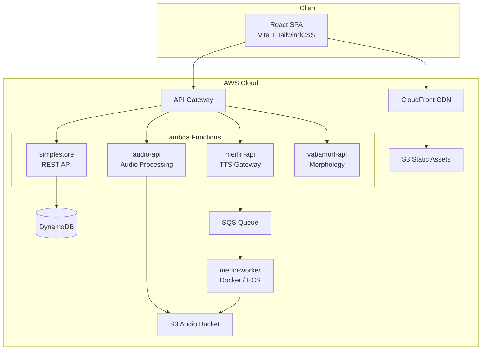
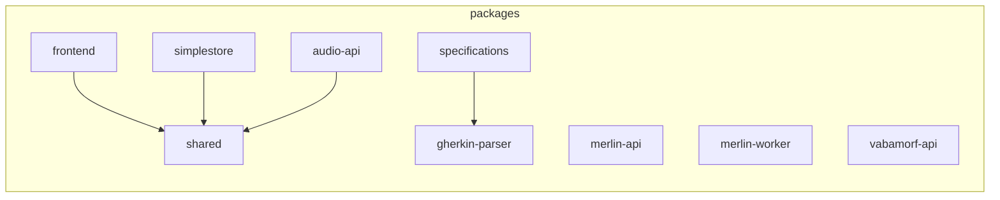
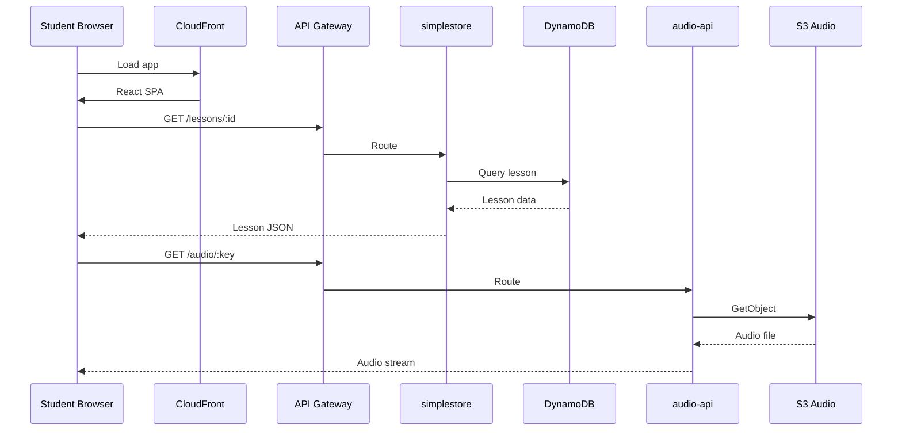
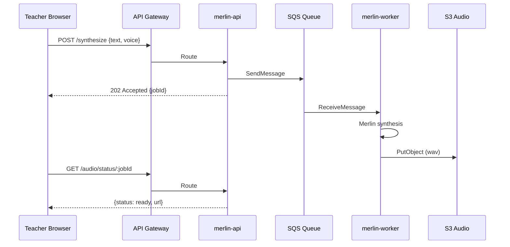

# Architecture

## System Overview



## Monorepo Structure



## Package Details

| Package | Tech | Runtime | Purpose |
|---------|------|---------|---------|
| `frontend` | React, Vite, TailwindCSS, Vitest | S3 + CloudFront | Teacher/student UI |
| `simplestore` | Express, DynamoDB SDK | Lambda | Lessons, users, progress CRUD |
| `audio-api` | Express, S3 SDK | Lambda | Audio upload, playback, storage |
| `merlin-api` | Express, SQS SDK | Lambda | TTS request gateway |
| `merlin-worker` | Python, Conda, Merlin | Docker (ECS) | Estonian speech synthesis |
| `vabamorf-api` | Express, native binary | Lambda (Docker) | Estonian morphological analysis |
| `shared` | TypeScript | — | Shared types, utilities, constants |
| `specifications` | Gherkin | — | BDD feature specifications |
| `gherkin-parser` | TypeScript | — | Gherkin-to-test mapping |

## Data Flow — Lesson Playback



## Data Flow — TTS Synthesis



## Infrastructure (Terraform)

```
infra/
  main.tf              # Provider, backend config
  variables.tf         # Input variables
  terraform.tfvars     # Environment values (not in git)
  api-gateway.tf       # API Gateway routes
  dynamodb.tf          # DynamoDB tables
  website.tf           # S3 + CloudFront for frontend
  audio.tf             # S3 audio bucket + Lambda
  ecr.tf               # ECR for Docker images
  cloudfront.tf        # CDN distribution
  route53.tf           # DNS records
  cloudwatch-*.tf      # Monitoring, alarms, dashboard
  slack-notifications.tf  # Alert notifications
```

## Quality System

Pre-commit hooks enforce quality on every commit:

```
commit → DevBox hooks (pre-commit stage)
  ├── TypeScript strict (run-typecheck)
  ├── ESLint zero warnings (run-lint)
  ├── All tests pass (run-tests)
  ├── TDD enforcement (test-required)
  ├── No any types (no-any)
  ├── No floating promises (no-floating-promises)
  ├── Import order (import-order)
  ├── No console.log (no-console)
  ├── Copy-paste detection (jscpd)
  ├── File size limits (source-size, markdown-size)
  ├── Language check (language-check)
  ├── Broken links (broken-links)
  ├── Dependency audit (security-audit)
  ├── Secret detection (secret-detection)
  ├── License check (license-check)
  └── Unused deps (dependency-check)
```
