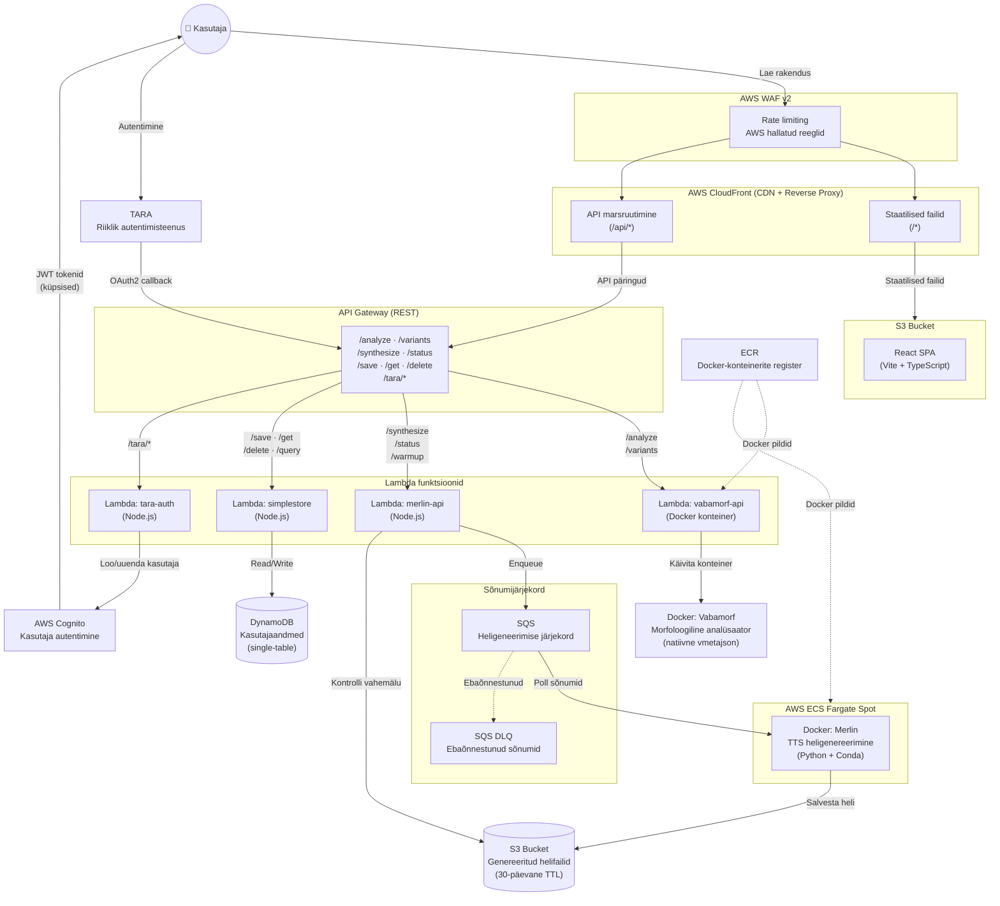
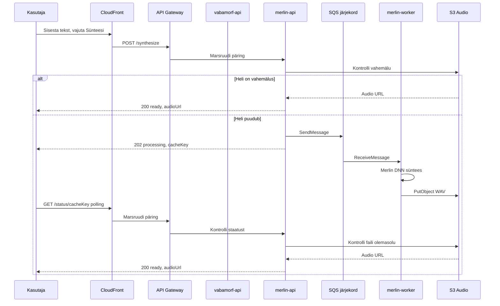
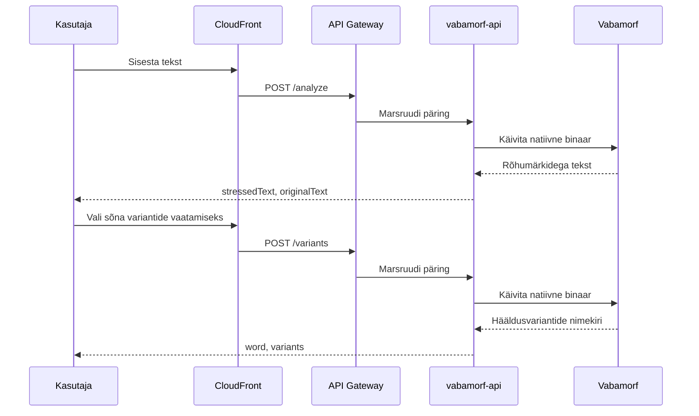
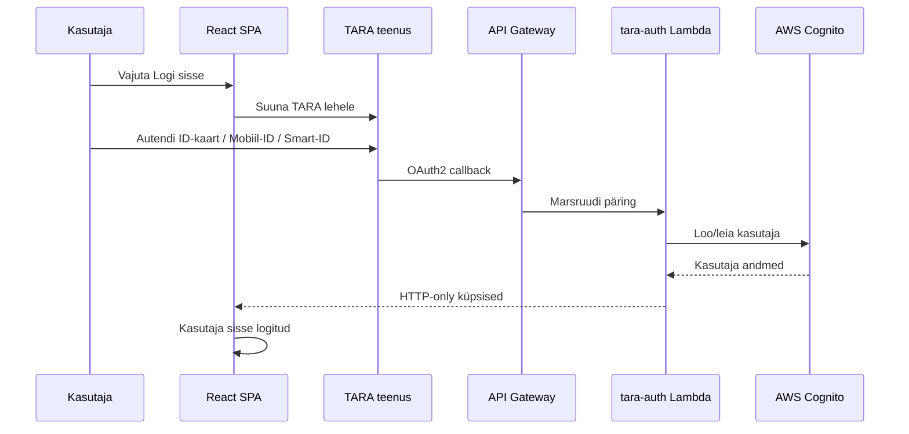

# Arhitektuuriskeem

## Üldine kirjeldus

Loodava e-vahendi eesmärk on toetada eesti keele kui teise keele (E2) õppijate ja õpetajate hääldusõpet, võimaldades kasutajatel kuulata ja visuaalselt eristada eesti keele hääldusele omaseid keerukaid aspekte nagu välteid ja palatalisatsiooni, mis on ortograafiliselt sageli mitteeristatavad, kuid kõnes olulised arusaadavuse seisukohalt.

Vahend luuakse MVP (Minimum Viable Product) põhimõttel, mis tähendab, et esmane versioon täidab põhifunktsioone, võimaldab esmase kasutuskogemuse ja kasutajate tagasiside kogumist edasiseks arenduseks.

Loodav lahendus on vabavaraline ja hästi dokumenteeritud, toetades jätkusuutlikku edasiarendust.

## Täiendused arhitektuurile projekti I etapi lõpuks

**Frontend: Angular vahetatud React vastu.** React on sobivam intensiivse kasutajasuhtlusega UI jaoks tänu virtuaalsele DOM-ile ja tõhusale renderdamise juhtimisele. Ühesuunaline andmevoog ja komponentpõhine arhitektuur võimaldavad paremat jõudlusoptimeerimist ja lihtsamat olekuhaldust kui Angulari raskem muutuste jälgimise mehhanism.

**Kasutaja autentimine TARA autentimisteenuse kaudu** vastavalt läbiviidud nõuete analüüsile. Autentimisvoo vahendamiseks lisatud eraldi `tara-auth` Lambda funktsioon, mis käsitleb OAuth2 callback'i, loob kasutaja AWS Cognito's ning väljastab tokenid HTTP-only küpsistena (vt ADR-005).

**Lisatud sõnumijärjekord (SQS)** backend'i ja Merlin DNN komponentide vahel. Merlin ei suuda paralleelselt töödelda mitut päringut korraga — päringud töödeldakse järjekorras ja asünkroonselt. Lisatud ka Dead Letter Queue (DLQ) ebaõnnestunud sõnumite käsitlemiseks.

**Andmebaasiks on valitud NoSQL** — DynamoDB single-table disainiga (PK/SK muster), mis võimaldab paindlikku andmemodelleerimist.

**Lisatud WAF v2** CloudFront'i ette — IP-põhine rate limiting (100 päringut / 5 min) ja AWS hallatud turvareeglid.

**Kõik API-liiklus marsruuditakse läbi CloudFront'i**, mis toimib nii CDN-ina staatiliste failide jaoks kui ka reverse proxy'na API päringute edastamiseks API Gateway'le.

## Visiooni olulised komponendid ja tehnoloogia

### Kõnesünteesikomponent

Kõnesünteesitehnoloogial (Merlin DNN mudelil) põhinev lahendus, mis võimaldab eristada hääldusnüansse, sh palatalisatsiooni, sõnarõhku ja välteid. Merlin töötab Docker konteineris AWS ECS Fargate Spot instantsidel, mis tagab kulude optimeerimise.

Sünteesimudelid jagunevad kaheks:
- **efm_s** — üksiksõnade sünteesimudel
- **efm_l** — lausete sünteesimudel (API vaikeväärtus)

### Vabamorf

Eesti keele reeglipõhine morfoloogiline analüüs ja märgendus. Komponent pakub kahte funktsionaalsust:
- **Rõhuanalüüs** (`/analyze`) — teisendab ortograafilise teksti rõhumärkidega varustatud kujule
- **Hääldusvariantide genereerimine** (`/variants`) — tagastab sõna hääldusvariantid koos morfoloogilise infoga (sõnaliik, kääne, tüvi)

Vabamorf töötab Lambda funktsioonis Docker konteinerina, mis sisaldab natiivset `vmetajson` binaari.

## Üldine arhitektuuriskeem

Lahenduse arhitektuur on struktureeritud kolme kihi kaupa.

### Kasutajaliidese kiht (Frontend)

Veebipõhine kasutajaliides React 19 raamistiku baasil (Vite, TypeScript, SCSS/BEM), mis võimaldab:
- Tekstisisestust ja kõnesünteesi mudeli valikut
- Tulemuste kuulamist ja erinevate hääldusvariantide võrdlemist
- Morfoloogilise info kuvamist ja hääldusmärkide visualiseerimist

Kasutajaliides järgib EKI stiiliraamatut (Storybook komponentide kaudu) ja tagab WCAG 2.1 AA ligipääsetavuse. Olekuhalduseks kasutatakse Zustand'i ja React Query't. Marsruutimine toimub React Router v7 kaudu.

### Rakenduse kiht (Backend ja API)

REST API, mille arhitektuur tugineb Clean Architecture põhimõtetele (core/adapters/lambda kihistus). Backend on arendatud Node.js ja TypeScript tehnoloogias, mis võimaldab ühist keelt kogu stackis.

API äriloogika hõlmab järgmisi funktsionaalsusi:
- Tekstide teisendamine ortograafilisest kujust häälduskujuliseks (Vabamorf)
- Hääldusmärkidega rikastatud teksti muutmine helifailideks (Merlin TTS)
- Kasutajaandmete CRUD-operatsioonid (SimpleStore)
- Kasutaja autentimine TARA kaudu (tara-auth)
- Turvaline andmeedastus TLS/SSL protokolli abil

**Avalikud vs. kaitstud API-d:**

| API | Autentimine | Rate limit |
|-----|-------------|------------|
| Vabamorf (`/analyze`, `/variants`) | Avalik | WAF rate limit |
| Merlin (`/synthesize`, `/status`) | Cognito JWT | 2 req/s, burst 4 |
| SimpleStore (`/save`, `/get`, `/delete`) | Cognito JWT | 10 req/s, burst 20 |
| SimpleStore (`/get-public`, `/get-shared`) | Avalik | 10 req/s, burst 20 |

### Keeletehnoloogiline kiht

Eesti keele morfoloogilise analüüsi jaoks kasutatakse Vabamorfi komponenti, mis vastutab teksti ühestamise, rõhumärkidega rikastamise ja hääldusvariantide genereerimise eest.

Kõnesünteesi jaoks kasutatakse Merlini DNN-põhiseid süntesaatoreid. Kui kasutaja sisestab teksti, liigub see esmalt Vabamorfi komponenti. Sealt edasi suunatakse morfoloogiliselt töödeldud tekst Merlini kõnesünteesi mootorisse, kus toimub lõplik kõne genereerimine. Genereeritud helifailid salvestatakse S3 failihoidlasse (30-päevane TTL), et vältida korduvat genereerimist.

## Komponentdiagramm

## Komponentide tabel

| Komponent | Kirjeldus |
|-----------|-----------|
| AWS WAF v2 | Veebirakenduse tulemüür (IP rate limiting, SQL injection / XSS kaitse) |
| CloudFront | CDN staatiliste failide jaoks + reverse proxy API päringutele |
| S3 Bucket (App) | React SPA staatilised failid |
| Cognito + TARA | Kasutaja autentimine (OIDC, küpsistepõhine) |
| Lambda: tara-auth | TARA OAuth2 callback, Cognito kasutaja loomine, JWT küpsised |
| API Gateway | REST API endpointid kõigi Lambda funktsioonide jaoks |
| Lambda: vabamorf-api | Morfoloogiline analüüs ja hääldusvariantide genereerimine (Docker konteiner) |
| Lambda: merlin-api | Kõnesünteesi gateway — SQS sõnumi loomine, S3 vahemälu kontroll (Node.js) |
| Lambda: simplestore | Kasutajaandmete CRUD — õppetükid, kasutajad, edenemine (Node.js) |
| Vabamorf | Eesti keele morfoloogiline analüsaator (natiivne `vmetajson` binaar) |
| DynamoDB | Kasutajapõhine andmesalvestus (single-table, PK/SK muster) |
| SQS + DLQ | Heligeneerimise järjekord + ebaõnnestunud sõnumite käsitlemine |
| ECR | Docker-konteinerite register (Merlin ja Vabamorf pildid) |
| ECS Fargate Spot | Merlin TTS heligenereerimine Docker konteineris (kulude optimeerimine) |
| S3 Bucket (Audio) | Genereeritud helifailid (vahemälu, 30-päevane TTL) |

## Andmevoog — kõnesüntees

## Andmevoog — morfoloogiline analüüs

## Andmevoog — autentimine

## Monitooring ja turvalisus

| Teenus | Eesmärk |
|--------|---------|
| CloudWatch Alarms | Veatuvastus ja häired (Lambda vead, SQS DLQ, ECS tervis) |
| CloudWatch Dashboard | Süsteemi ülevaate paneel (päringute arv, latentsus, vead) |
| GuardDuty | AWS konto ohutuvastus |
| CloudTrail | Auditi logid (API kutsed, ressursside muudatused) |
| Slack Notifications | Häirete edastamine Slack'i kanalisse |

## Infrastruktuur

Kogu infrastruktuur on hallatud Terraform'iga (`infra/` kataloogis). Keskkonnad:

| Keskkond | Frontend | API |
|----------|----------|-----|
| Arendus (dev) | `hak-dev.{domeen}` | `hak-api-dev.{domeen}` |
| Tootmine (prod) | `hak.{domeen}` | `hak-api.{domeen}` |
